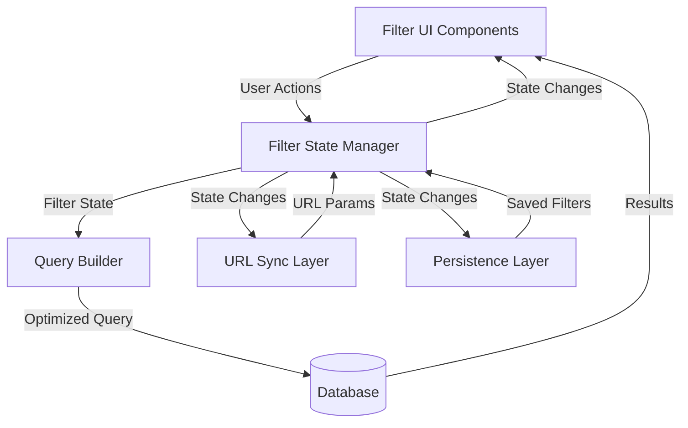

# Design Document: Advanced Search and Filters

## Overview

The advanced search and filtering system provides users with powerful tools to refine product searches using multiple criteria. The system is built around a reactive architecture where filter changes trigger optimized queries and update both the UI and URL state. The design emphasizes performance through query optimization, user experience through responsive UI design, and shareability through URL parameter synchronization.

The system consists of five main components:
1. **Filter UI Components** - Interactive controls for selecting filter criteria
2. **Filter State Manager** - Centralized state management for active filters
3. **Query Builder** - Translates filter state into optimized database queries
4. **URL Synchronization Layer** - Bidirectional sync between filter state and URL parameters
5. **Persistence Layer** - Saves and restores filter preferences across sessions

## Architecture

### High-Level Architecture



### Component Interaction Flow

1. **User Interaction Flow**:
   - User interacts with Filter UI (selects price range, rating, etc.)
   - Filter UI dispatches action to Filter State Manager
   - Filter State Manager updates internal state
   - State Manager notifies all subscribers (UI, URL Sync, Persistence)
   - Query Builder generates optimized query from new state
   - Results are fetched and displayed

2. **URL Navigation Flow**:
   - User navigates to URL with filter parameters
   - URL Sync Layer parses parameters
   - Filter State Manager is initialized with parsed filters
   - UI renders with active filters
   - Query executes and displays results

3. **Session Restoration Flow**:
   - User returns to search page
   - Persistence Layer checks for saved filters
   - If URL has parameters, URL takes precedence
   - Otherwise, saved filters are restored
   - Filter State Manager initializes with restored state

## Components and Interfaces

### 1. Filter State Manager

The central state management component that maintains the current filter configuration.

**State Structure**:
```typescript
interface FilterState {
  priceRange: {
    min: number | null;
    max: number | null;
  };
  minRating: number | null;
  availability: {
    inStock: boolean;
    outOfStock: boolean;
  };
}
```

**Interface**:
```typescript
interface FilterStateManager {
  // Get current filter state
  getState(): FilterState;
  
  // Update filter state
  setPriceRange(min: number | null, max: number | null): void;
  setMinRating(rating: number | null): void;
  setAvailability(inStock: boolean, outOfStock: boolean): void;
  
  // Clear filters
  clearAll(): void;
  clearPriceRange(): void;
  clearRating(): void;
  clearAvailability(): void;
  
  // Subscribe to state changes
  subscribe(callback: (state: FilterState) => void): () => void;
  
  // Initialize from external source
  initialize(state: Partial<FilterState>): void;
}
```

**Responsibilities**:
- Maintain single source of truth for filter state
- Validate filter values (e.g., min <= max for price)
- Notify subscribers when state changes
- Provide methods for atomic state updates

### 2. Filter UI Components

Interactive components for user filter selection.

**Price Range Filter Component**:
```typescript
interface PriceRangeFilterProps {
  min: number | null;
  max: number | null;
  onChange: (min: number | null, max: number | null) => void;
  currency: string;
}

interface PriceRangeFilter {
  render(): UIElement;
  validate(): boolean;
}
```

**Rating Filter Component**:
```typescript
interface RatingFilterProps {
  minRating: number | null;
  onChange: (rating: number | null) => void;
  options: number[]; // e.g., [1, 2, 3, 4, 5]
}

interface RatingFilter {
  render(): UIElement;
}
```

**Availability Filter Component**:
```typescript
interface AvailabilityFilterProps {
  inStock: boolean;
  outOfStock: boolean;
  onChange: (inStock: boolean, outOfStock: boolean) => void;
}

interface AvailabilityFilter {
  render(): UIElement;
}
```

**Filter Summary Component**:
```typescript
interface FilterSummaryProps {
  activeFilters: FilterState;
  resultCount: number;
  onClearAll: () => void;
  onRemoveFilter: (filterKey: string) => void;
}

interface FilterSummary {
  render(): UIElement;
}
```

**Responsibilities**:
- Render accessible, responsive filter controls
- Validate user input before dispatching changes
- Display current filter state clearly
- Provide visual feedback for active filters
- Support keyboard navigation and screen readers

### 3. Query Builder

Translates filter state into optimized database queries.

**Interface**:
```typescript
interface QueryBuilder {
  // Build query from filter state
  buildQuery(filters: FilterState): DatabaseQuery;
  
  // Get result count without fetching full results
  buildCountQuery(filters: FilterState): DatabaseQuery;
  
  // Optimize query with indexes and caching hints
  optimize(query: DatabaseQuery): DatabaseQuery;
}

interface DatabaseQuery {
  sql: string;
  parameters: Record<string, any>;
  useCache: boolean;
  cacheKey?: string;
}
```

**Query Construction Logic**:

For price range filtering:
```sql
WHERE price >= :minPrice AND price <= :maxPrice
```

For rating filtering:
```sql
WHERE rating >= :minRating AND rating IS NOT NULL
```

For availability filtering:
```sql
-- In stock only
WHERE inventory_count > 0

-- Out of stock only
WHERE inventory_count = 0

-- Both (no constraint)
-- No WHERE clause added
```

Combined filters use AND logic:
```sql
WHERE 
  price >= :minPrice 
  AND price <= :maxPrice
  AND rating >= :minRating
  AND rating IS NOT NULL
  AND inventory_count > 0
```

**Optimization Strategies**:
- Use composite indexes on (price, rating, inventory_count)
- Generate cache keys based on filter combinations
- Use query result caching for common filter combinations
- Avoid full table scans by ensuring indexed columns in WHERE clauses
- Use EXPLAIN ANALYZE to validate query performance

**Responsibilities**:
- Generate syntactically correct SQL queries
- Apply appropriate indexes and optimization hints
- Handle null values and edge cases
- Generate cache keys for result caching
- Ensure queries complete within performance targets

### 4. URL Synchronization Layer

Manages bidirectional synchronization between filter state and URL parameters.

**Interface**:
```typescript
interface URLSyncLayer {
  // Encode filter state to URL parameters
  encodeToURL(filters: FilterState): string;
  
  // Decode URL parameters to filter state
  decodeFromURL(urlParams: string): Partial<FilterState>;
  
  // Update browser URL without reload
  updateURL(filters: FilterState): void;
  
  // Listen for URL changes (back/forward navigation)
  onURLChange(callback: (filters: Partial<FilterState>) => void): () => void;
}
```

**URL Parameter Format**:
```
?minPrice=10&maxPrice=100&minRating=4&availability=inStock
```

**Encoding Rules**:
- `minPrice`: Minimum price value (number)
- `maxPrice`: Maximum price value (number)
- `minRating`: Minimum rating value (1-5)
- `availability`: Comma-separated values: "inStock", "outOfStock", or "inStock,outOfStock"
- Omit parameters with null values
- Use URL encoding for special characters

**Decoding Rules**:
- Parse numeric values with validation
- Handle missing parameters as null
- Validate parameter values (e.g., rating must be 1-5)
- Return partial state for invalid parameters
- Ignore unknown parameters

**Responsibilities**:
- Encode filter state to URL-safe format
- Decode URL parameters to filter state
- Update browser history without page reload
- Handle browser back/forward navigation
- Validate URL parameters

### 5. Persistence Layer

Saves and restores filter preferences using browser storage.

**Interface**:
```typescript
interface PersistenceLayer {
  // Save current filter state
  saveFilters(filters: FilterState): void;
  
  // Load saved filter state
  loadFilters(): FilterState | null;
  
  // Clear saved filters
  clearFilters(): void;
  
  // Check if filters are saved
  hasFilters(): boolean;
}
```

**Storage Strategy**:
- Use `localStorage` for persistence across sessions
- Storage key: `search_filters_v1`
- Store as JSON string
- Include version number for future migrations
- Maximum storage size: 5KB (well within localStorage limits)

**Storage Format**:
```json
{
  "version": 1,
  "filters": {
    "priceRange": {
      "min": 10,
      "max": 100
    },
    "minRating": 4,
    "availability": {
      "inStock": true,
      "outOfStock": false
    }
  },
  "timestamp": 1234567890
}
```

**Responsibilities**:
- Serialize filter state to JSON
- Deserialize JSON to filter state
- Handle storage errors gracefully
- Validate loaded data structure
- Clear stale data (optional: expire after 30 days)

## Data Models

### FilterState

The core data model representing active filters.

```typescript
interface FilterState {
  priceRange: PriceRange;
  minRating: number | null;
  availability: AvailabilityFilter;
}

interface PriceRange {
  min: number | null;
  max: number | null;
}

interface AvailabilityFilter {
  inStock: boolean;
  outOfStock: boolean;
}
```

**Invariants**:
- If `priceRange.min` is set, it must be >= 0
- If `priceRange.max` is set, it must be >= 0
- If both `priceRange.min` and `priceRange.max` are set, then `min <= max`
- If `minRating` is set, it must be in range [1, 5]
- `availability.inStock` and `availability.outOfStock` are independent boolean flags

**Default State**:
```typescript
const DEFAULT_FILTER_STATE: FilterState = {
  priceRange: {
    min: null,
    max: null
  },
  minRating: null,
  availability: {
    inStock: false,
    outOfStock: false
  }
};
```

### Product Model (for filtering)

The product data structure relevant to filtering operations.

```typescript
interface Product {
  id: string;
  name: string;
  price: number;
  rating: number | null;
  inventoryCount: number;
  // ... other fields
}
```

**Filtering Logic**:
- Price filter: Compare `product.price` with `priceRange.min` and `priceRange.max`
- Rating filter: Compare `product.rating` with `minRating` (exclude if rating is null)
- Availability filter: Check `product.inventoryCount > 0` for in-stock

### Query Result Model

```typescript
interface FilteredResults {
  products: Product[];
  totalCount: number;
  appliedFilters: FilterState;
  executionTime: number; // milliseconds
}
```

## Error Handling

### Input Validation Errors

**Invalid Price Range**:
- **Scenario**: User enters min price > max price
- **Handling**: Display inline error message, prevent filter application
- **Recovery**: Allow user to correct values

**Invalid Rating Value**:
- **Scenario**: Rating value outside 1-5 range
- **Handling**: Clamp to valid range or reject input
- **Recovery**: Display valid range to user

**Invalid URL Parameters**:
- **Scenario**: URL contains malformed filter parameters
- **Handling**: Ignore invalid parameters, use defaults
- **Recovery**: Log warning, continue with valid parameters

### Storage Errors

**localStorage Unavailable**:
- **Scenario**: Browser has localStorage disabled or quota exceeded
- **Handling**: Gracefully degrade to session-only filters
- **Recovery**: Display notice to user (optional)

**Corrupted Stored Data**:
- **Scenario**: Stored filter data is invalid JSON or wrong structure
- **Handling**: Clear corrupted data, use default state
- **Recovery**: Log error, continue with defaults

### Query Errors

**Database Query Timeout**:
- **Scenario**: Query exceeds 500ms timeout
- **Handling**: Cancel query, display error message
- **Recovery**: Suggest simplifying filters or retry

**Database Connection Error**:
- **Scenario**: Cannot connect to database
- **Handling**: Display user-friendly error message
- **Recovery**: Provide retry button, fallback to cached results if available

### UI Errors

**Component Render Error**:
- **Scenario**: Filter component fails to render
- **Handling**: Display error boundary with fallback UI
- **Recovery**: Allow user to refresh or continue without filters

## Testing Strategy

The testing strategy employs both unit tests for specific scenarios and property-based tests for universal correctness properties.

### Unit Testing

**Filter State Manager**:
- Test state initialization with default values
- Test individual filter updates (price, rating, availability)
- Test clearAll functionality
- Test subscriber notification on state changes
- Test validation of invalid inputs (min > max)

**Query Builder**:
- Test query generation for each filter type individually
- Test combined filter query generation
- Test query optimization with cache keys
- Test handling of null/undefined filter values
- Test SQL injection prevention

**URL Sync Layer**:
- Test encoding filter state to URL parameters
- Test decoding URL parameters to filter state
- Test handling of missing parameters
- Test handling of invalid parameter values
- Test URL update without page reload

**Persistence Layer**:
- Test saving filters to localStorage
- Test loading filters from localStorage
- Test clearing saved filters
- Test handling of corrupted data
- Test handling of localStorage unavailable

**Filter UI Components**:
- Test rendering with various filter states
- Test user interaction (clicks, input changes)
- Test validation feedback display
- Test accessibility (keyboard navigation, ARIA labels)
- Test responsive behavior at different screen sizes

### Property-Based Testing

Property-based tests will be written for universal correctness properties identified in the Correctness Properties section. Each property test will:
- Run a minimum of 100 iterations with randomized inputs
- Reference the specific design property being validated
- Use appropriate generators for test data
- Tag tests with format: **Feature: advanced-search-filters, Property {N}: {property_text}**

### Integration Testing

**End-to-End Filter Flow**:
- Test complete user journey: select filters → view results → share URL → restore from URL
- Test filter persistence across page reloads
- Test browser back/forward navigation with filters
- Test performance with large datasets (10,000+ products)

### Performance Testing

**Query Performance**:
- Measure query execution time with various filter combinations
- Verify queries complete within 500ms for 100,000 products
- Test cache effectiveness for common filter combinations

**UI Responsiveness**:
- Measure time from filter change to UI update
- Verify UI remains responsive during query execution
- Test with throttled network conditions


## Correctness Properties

A property is a characteristic or behavior that should hold true across all valid executions of a system—essentially, a formal statement about what the system should do. Properties serve as the bridge between human-readable specifications and machine-verifiable correctness guarantees.

### Property 1: Price Range Filtering Correctness

*For any* set of products and any valid price range (where min ≤ max), applying the price filter should return only products whose price falls within the specified range inclusive, and all such products should be included in the results.

**Validates: Requirements 1.1, 1.2, 1.3**

### Property 2: Price Filter Clearing Restores Unfiltered State

*For any* set of products and any price filter, applying the filter then clearing it should return the same set of products as if no filter was ever applied.

**Validates: Requirements 1.4**

### Property 3: Rating Filter Correctness

*For any* set of products and any minimum rating value (1-5), applying the rating filter should return only products with ratings greater than or equal to the minimum rating, excluding products with null ratings.

**Validates: Requirements 2.1, 2.4**

### Property 4: Rating Filter Clearing Restores Unfiltered State

*For any* set of products and any rating filter, applying the filter then clearing it should return the same set of products as if no filter was ever applied.

**Validates: Requirements 2.2**

### Property 5: In-Stock Filter Correctness

*For any* set of products, enabling the in-stock filter should return only products with inventory count greater than zero.

**Validates: Requirements 3.1**

### Property 6: Out-of-Stock Filter Correctness

*For any* set of products, enabling the out-of-stock filter should return only products with inventory count equal to zero.

**Validates: Requirements 3.2**

### Property 7: Both Availability Options Equivalent to No Filter

*For any* set of products, enabling both in-stock and out-of-stock filters should return the same results as having no availability filter applied.

**Validates: Requirements 3.3, 3.4**

### Property 8: Multiple Filters Use AND Logic

*For any* set of products and any combination of active filters (price, rating, availability), the returned products should satisfy ALL active filter conditions simultaneously.

**Validates: Requirements 4.1**

### Property 9: Adding Filters Never Increases Results

*For any* set of products and any current filter state, adding an additional filter constraint should return a result set that is a subset of or equal to the current results (monotonic decrease).

**Validates: Requirements 4.2**

### Property 10: Removing Filters Never Decreases Results

*For any* set of products and any current filter state with at least one active filter, removing a filter constraint should return a result set that is a superset of or equal to the current results (monotonic increase).

**Validates: Requirements 4.3**

### Property 11: URL Encoding Round-Trip Consistency

*For any* valid filter state, encoding it to URL parameters then decoding those parameters should produce an equivalent filter state.

**Validates: Requirements 6.1, 6.2, 6.3**

### Property 12: Persistence Round-Trip Consistency

*For any* valid filter state, saving it to storage then loading from storage should produce an equivalent filter state.

**Validates: Requirements 7.1, 7.2**

### Property 13: Clearing Filters Removes Persisted State

*For any* filter state that has been saved to storage, clearing all filters should result in no saved filter state being present in storage.

**Validates: Requirements 7.3**

### Property 14: Result Count Matches Filtered Results

*For any* set of products and any filter state, the displayed result count should exactly equal the number of products in the filtered results.

**Validates: Requirements 9.1**

### Property 15: Clear All Returns to Default State

*For any* filter state with one or more active filters, invoking clear all should return the filter state to the default state with no active filters.

**Validates: Requirements 10.2, 10.3**

### Property 16: Clearing Filters Removes URL Parameters

*For any* filter state with URL parameters present, clearing all filters should result in a URL with no filter parameters.

**Validates: Requirements 10.4**
