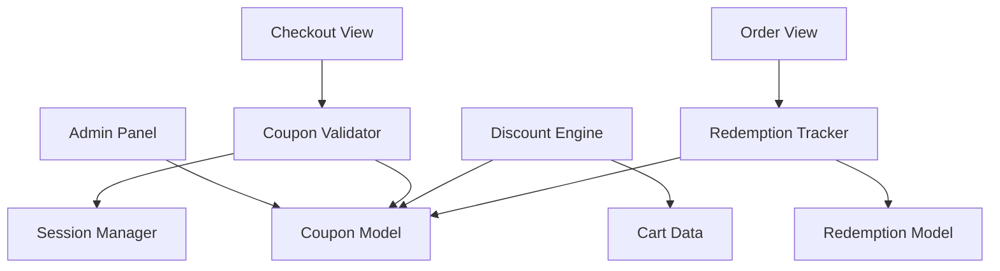

# Design Document: Discount Codes/Coupons

## Overview

The discount code system extends the GreatKart e-commerce application with promotional coupon functionality. The design integrates with the existing Django architecture, adding a new `coupons` app that manages coupon creation, validation, and redemption. The system modifies the checkout flow to accept coupon codes, calculates discounts before tax, and tracks usage for analytics.

The implementation follows Django best practices with model-view-template architecture, leveraging Django's admin interface for coupon management and session framework for persistence.

## Architecture

### High-Level Architecture



### Component Interaction Flow

1. **Admin creates coupon** → Coupon stored in database
2. **User enters code at checkout** → Validation checks all criteria
3. **Valid coupon** → Discount calculated and applied to order summary
4. **Order placed** → Redemption recorded, usage counts incremented
5. **Session cleared** → Coupon removed from session

### Integration Points

- **Orders app**: Modified to store coupon code and discount amount
- **Carts app**: Cart total used for minimum order validation and discount calculation
- **Accounts app**: User model used for per-user usage tracking
- **Django sessions**: Store applied coupon during checkout flow
- **Django admin**: Coupon and redemption management interface

## Components and Interfaces

### 1. Coupon Model

**Purpose**: Stores coupon configuration and rules

**Fields**:
- `code` (CharField, unique, max_length=50): Uppercase coupon code
- `discount_type` (CharField, choices=['percentage', 'fixed']): Type of discount
- `discount_value` (DecimalField): Percentage (0-100) or fixed amount
- `minimum_order_value` (DecimalField, nullable): Minimum cart total required
- `max_usage_limit` (IntegerField, nullable): Total redemption limit
- `max_usage_per_user` (IntegerField, nullable): Per-user redemption limit
- `valid_from` (DateTimeField): Start of validity period
- `valid_to` (DateTimeField): End of validity period
- `is_active` (BooleanField): Enable/disable coupon
- `created_at` (DateTimeField, auto_now_add)
- `updated_at` (DateTimeField, auto_now)

**Methods**:
- `clean()`: Validates discount_value based on discount_type
- `save()`: Converts code to uppercase before saving
- `__str__()`: Returns coupon code

**Constraints**:
- Percentage discounts: 0 < discount_value ≤ 100
- Fixed discounts: discount_value > 0
- valid_from < valid_to

### 2. Redemption Model

**Purpose**: Tracks coupon usage history

**Fields**:
- `coupon` (ForeignKey to Coupon): The redeemed coupon
- `user` (ForeignKey to Account, nullable): User who redeemed (null for guests)
- `order` (ForeignKey to Order): Associated order
- `discount_amount` (DecimalField): Actual discount applied
- `redeemed_at` (DateTimeField, auto_now_add): Redemption timestamp

**Methods**:
- `__str__()`: Returns formatted redemption info

**Indexes**:
- Composite index on (coupon, user) for per-user usage queries
- Index on coupon for total usage queries

### 3. Coupon Validator

**Purpose**: Validates coupon eligibility before application

**Interface**:
```python
class CouponValidator:
    def validate(code: str, cart_total: Decimal, user: Account) -> ValidationResult
```

**Validation Steps**:
1. Check coupon exists (case-insensitive lookup)
2. Check is_active = True
3. Check current_datetime >= valid_from AND current_datetime <= valid_to
4. Check cart_total >= minimum_order_value (if set)
5. Check total_redemptions < max_usage_limit (if set)
6. Check user_redemptions < max_usage_per_user (if set)

**Return Type**:
```python
ValidationResult:
    is_valid: bool
    coupon: Coupon | None
    error_message: str | None
```

**Error Messages**:
- "Invalid coupon code"
- "This coupon is not active"
- "This coupon has expired"
- "Minimum order value of ${amount} required"
- "This coupon has reached its usage limit"
- "You have already used this coupon the maximum number of times"

### 4. Discount Engine

**Purpose**: Calculates discount amount based on coupon type

**Interface**:
```python
class DiscountEngine:
    def calculate_discount(coupon: Coupon, cart_total: Decimal) -> Decimal
```

**Calculation Logic**:

**Percentage Discount**:
```
discount = cart_total × (discount_value / 100)
```

**Fixed Amount Discount**:
```
discount = min(discount_value, cart_total)
```

**Order Total Calculation**:
```
subtotal = cart_total
discount = calculate_discount(coupon, cart_total)
discounted_subtotal = subtotal - discount
tax = discounted_subtotal × 0.02
grand_total = discounted_subtotal + tax
```

### 5. Checkout View (Modified)

**Purpose**: Handles coupon application during checkout

**New Endpoints**:
- `POST /checkout/apply-coupon/`: Apply coupon code
- `POST /checkout/remove-coupon/`: Remove applied coupon

**Apply Coupon Flow**:
1. Retrieve coupon code from POST data
2. Get cart total from cart items
3. Validate coupon using CouponValidator
4. If valid:
   - Calculate discount using DiscountEngine
   - Store coupon code in session
   - Return success with discount amount
5. If invalid:
   - Return error message

**Remove Coupon Flow**:
1. Clear coupon code from session
2. Recalculate order total without discount
3. Return success

**Session Keys**:
- `applied_coupon_code`: Stores the coupon code string

### 6. Order Model (Modified)

**Purpose**: Store coupon information with completed orders

**New Fields**:
- `coupon_code` (CharField, max_length=50, nullable): Applied coupon code
- `discount_amount` (DecimalField, default=0): Discount applied

**Modified Calculation**:
```python
def calculate_order_total():
    subtotal = sum(item.product.price × item.quantity for item in order_items)
    discount = discount_amount  # From applied coupon
    discounted_subtotal = subtotal - discount
    tax = discounted_subtotal × 0.02
    order_total = discounted_subtotal + tax
```

### 7. Redemption Tracker

**Purpose**: Records coupon usage when orders are placed

**Interface**:
```python
class RedemptionTracker:
    def record_redemption(coupon: Coupon, order: Order, user: Account, discount_amount: Decimal) -> Redemption
```

**Process**:
1. Create Redemption record
2. Link to coupon, order, and user
3. Store discount amount
4. Save with timestamp

**Usage Count Queries**:
```python
def get_total_usage(coupon: Coupon) -> int:
    return Redemption.objects.filter(coupon=coupon).count()

def get_user_usage(coupon: Coupon, user: Account) -> int:
    return Redemption.objects.filter(coupon=coupon, user=user).count()
```

## Data Models

### Coupon Model Schema

```python
class Coupon(models.Model):
    DISCOUNT_TYPE_CHOICES = [
        ('percentage', 'Percentage'),
        ('fixed', 'Fixed Amount'),
    ]
    
    code = models.CharField(max_length=50, unique=True)
    discount_type = models.CharField(max_length=10, choices=DISCOUNT_TYPE_CHOICES)
    discount_value = models.DecimalField(max_digits=10, decimal_places=2)
    minimum_order_value = models.DecimalField(max_digits=10, decimal_places=2, null=True, blank=True)
    max_usage_limit = models.IntegerField(null=True, blank=True)
    max_usage_per_user = models.IntegerField(null=True, blank=True)
    valid_from = models.DateTimeField()
    valid_to = models.DateTimeField()
    is_active = models.BooleanField(default=True)
    created_at = models.DateTimeField(auto_now_add=True)
    updated_at = models.DateTimeField(auto_now=True)
    
    class Meta:
        ordering = ['-created_at']
```

### Redemption Model Schema

```python
class Redemption(models.Model):
    coupon = models.ForeignKey(Coupon, on_delete=models.CASCADE, related_name='redemptions')
    user = models.ForeignKey(Account, on_delete=models.SET_NULL, null=True, blank=True)
    order = models.OneToOneField(Order, on_delete=models.CASCADE)
    discount_amount = models.DecimalField(max_digits=10, decimal_places=2)
    redeemed_at = models.DateTimeField(auto_now_add=True)
    
    class Meta:
        ordering = ['-redeemed_at']
        indexes = [
            models.Index(fields=['coupon', 'user']),
            models.Index(fields=['coupon']),
        ]
```

### Order Model Modifications

```python
class Order(models.Model):
    # ... existing fields ...
    coupon_code = models.CharField(max_length=50, null=True, blank=True)
    discount_amount = models.DecimalField(max_digits=10, decimal_places=2, default=0)
    # ... existing fields ...
```

## Correctness Properties


A property is a characteristic or behavior that should hold true across all valid executions of a system—essentially, a formal statement about what the system should do. Properties serve as the bridge between human-readable specifications and machine-verifiable correctness guarantees.

### Property 1: Unique Coupon Codes

*For any* two coupons, their codes must be distinct (case-insensitive comparison).

**Validates: Requirements 1.2**

### Property 2: Order Total Calculation Correctness

*For any* valid coupon and cart total, the final order total must equal (cart_total - discount + tax), where discount is calculated according to the coupon type and tax is 2% of the discounted subtotal.

**Validates: Requirements 2.1, 2.2, 2.5**

### Property 3: Fixed Discount Capping

*For any* fixed amount coupon where the discount value exceeds the cart total, the applied discount must equal the cart total (preventing negative totals).

**Validates: Requirements 2.3**

### Property 4: Tax Applied After Discount

*For any* order with a coupon applied, the tax amount must be calculated as 2% of (cart_total - discount), not 2% of the original cart_total.

**Validates: Requirements 2.4**

### Property 5: Invalid Code Rejection

*For any* coupon code that does not exist in the database, validation must fail with an appropriate error message.

**Validates: Requirements 3.1**

### Property 6: Inactive Coupon Rejection

*For any* coupon where is_active is False, validation must fail regardless of other criteria.

**Validates: Requirements 3.2**

### Property 7: Date Range Validation

*For any* coupon, validation must fail if the current datetime is before valid_from or after valid_to.

**Validates: Requirements 3.3**

### Property 8: Minimum Order Value Enforcement

*For any* coupon with a minimum_order_value set, validation must fail if the cart total is less than this value.

**Validates: Requirements 3.4**

### Property 9: Maximum Usage Limit Enforcement

*For any* coupon with a max_usage_limit set, validation must fail if the total redemption count equals or exceeds this limit.

**Validates: Requirements 3.5**

### Property 10: Per-User Usage Limit Enforcement

*For any* coupon with a max_usage_per_user set and a specific user, validation must fail if that user's redemption count equals or exceeds this limit.

**Validates: Requirements 3.6**

### Property 11: Validation Result Completeness

*For any* validation attempt, the result must include is_valid (boolean), and if invalid, must include a non-empty error_message.

**Validates: Requirements 3.7, 3.8**

### Property 12: Single Coupon Enforcement

*For any* checkout session with a coupon already applied, attempting to apply a different coupon must fail with an error indicating only one coupon is allowed.

**Validates: Requirements 5.1**

### Property 13: Redemption Record Creation

*For any* order placed with a valid coupon, a redemption record must be created linking the coupon, order, user, and discount amount.

**Validates: Requirements 6.1, 6.2**

### Property 14: Usage Count Accuracy

*For any* coupon, the total redemption count must equal the number of redemption records, and for any user, their per-user count must equal the number of redemption records for that user and coupon.

**Validates: Requirements 6.3, 6.4**

### Property 15: Session Persistence

*For any* coupon successfully applied, the coupon code must be stored in the session and remain accessible across subsequent requests until explicitly removed or the order is completed.

**Validates: Requirements 8.1**

### Property 16: Order Record Persistence

*For any* order placed with a coupon, the order record must store both the coupon_code and discount_amount, and these values must remain unchanged even if the coupon is later modified or deleted.

**Validates: Requirements 9.1, 9.2, 9.4**

### Property 17: Case-Insensitive Code Matching

*For any* coupon code entered by a user (regardless of case), the system must match it to the stored coupon by converting both to uppercase for comparison, and all stored codes must be in uppercase.

**Validates: Requirements 10.1, 10.2, 10.3**

## Error Handling

### Validation Errors

**Invalid Coupon Code**:
- Scenario: User enters non-existent code
- Response: HTTP 400 with message "Invalid coupon code"
- Action: Display error, keep input field active

**Inactive Coupon**:
- Scenario: Coupon exists but is_active = False
- Response: HTTP 400 with message "This coupon is not active"
- Action: Display error, clear input field

**Expired Coupon**:
- Scenario: Current date outside validity period
- Response: HTTP 400 with message "This coupon has expired"
- Action: Display error, clear input field

**Minimum Order Not Met**:
- Scenario: Cart total below minimum_order_value
- Response: HTTP 400 with message "Minimum order value of ${amount} required"
- Action: Display error with specific amount, keep input field active

**Usage Limit Reached**:
- Scenario: Total redemptions >= max_usage_limit
- Response: HTTP 400 with message "This coupon has reached its usage limit"
- Action: Display error, clear input field

**Per-User Limit Reached**:
- Scenario: User redemptions >= max_usage_per_user
- Response: HTTP 400 with message "You have already used this coupon the maximum number of times"
- Action: Display error, clear input field

**Coupon Already Applied**:
- Scenario: Attempting to apply second coupon
- Response: HTTP 400 with message "Only one coupon can be applied per order. Please remove the current coupon first."
- Action: Display error, highlight remove button

### System Errors

**Database Errors**:
- Scenario: Database connection failure during validation/redemption
- Response: HTTP 500 with generic error message
- Action: Log error, display "Unable to process coupon. Please try again."
- Recovery: Retry mechanism for transient failures

**Session Errors**:
- Scenario: Session storage failure
- Response: Continue without session persistence
- Action: Log warning, coupon still applied for current request
- Recovery: User may need to re-apply coupon if they navigate away

**Calculation Errors**:
- Scenario: Decimal overflow or invalid arithmetic
- Response: HTTP 500 with generic error message
- Action: Log error with coupon details, display "Unable to calculate discount"
- Recovery: Admin review of coupon configuration

### Edge Cases

**Zero Cart Total**:
- Scenario: Cart total is 0 (e.g., all free items)
- Behavior: Reject coupon application with message "Coupon cannot be applied to orders with zero value"

**Concurrent Redemptions**:
- Scenario: Multiple users redeeming same coupon simultaneously near usage limit
- Behavior: Use database-level locking or atomic increment to prevent over-redemption
- Implementation: Use select_for_update() in Django when checking usage limits

**Coupon Deleted During Checkout**:
- Scenario: Admin deletes coupon while user has it applied in session
- Behavior: Validation fails when user proceeds to payment
- Action: Display "This coupon is no longer available" and clear from session

**Order Cancellation**:
- Scenario: Order is cancelled after redemption recorded
- Behavior: Redemption record remains (for audit trail), but usage counts should be decremented
- Implementation: Signal handler on order cancellation to adjust counts

## Testing Strategy

### Dual Testing Approach

The testing strategy employs both unit tests and property-based tests to ensure comprehensive coverage:

**Unit Tests**: Focus on specific examples, edge cases, and integration points
- Specific coupon validation scenarios (expired, inactive, etc.)
- UI rendering with and without applied coupons
- Admin interface functionality
- Session management edge cases
- Error message formatting

**Property-Based Tests**: Verify universal properties across all inputs
- Discount calculation correctness for all coupon types and cart values
- Validation logic for all possible coupon configurations
- Usage counting accuracy across multiple redemptions
- Case-insensitive matching for all code variations
- Order total calculation for all combinations of discounts and taxes

### Property-Based Testing Configuration

**Library**: Use **Hypothesis** for Python/Django property-based testing

**Configuration**:
- Minimum 100 iterations per property test
- Each test tagged with format: **Feature: discount-codes, Property {N}: {property_text}**
- Custom generators for:
  - Valid coupon configurations (all field combinations)
  - Cart totals (positive decimals with 2 decimal places)
  - Discount values (percentages 0-100, fixed amounts > 0)
  - Date ranges (valid_from < valid_to)
  - Usage counts (0 to max_limit)

**Example Test Structure**:
```python
from hypothesis import given, strategies as st
from decimal import Decimal

@given(
    cart_total=st.decimals(min_value=Decimal('0.01'), max_value=Decimal('10000'), places=2),
    discount_percentage=st.decimals(min_value=Decimal('0.01'), max_value=Decimal('100'), places=2)
)
def test_property_2_order_total_calculation(cart_total, discount_percentage):
    """
    Feature: discount-codes, Property 2: Order Total Calculation Correctness
    For any valid coupon and cart total, the final order total must equal 
    (cart_total - discount + tax)
    """
    # Test implementation
    pass
```

### Test Coverage Requirements

**Model Tests**:
- Coupon model validation (discount_value constraints)
- Coupon code uppercase conversion
- Redemption model creation and relationships
- Order model discount field storage

**Validator Tests**:
- All validation rules (properties 5-11)
- Error message accuracy
- Edge cases (null values, boundary conditions)

**Discount Engine Tests**:
- Percentage calculation (property 2)
- Fixed amount calculation (property 2)
- Fixed amount capping (property 3)
- Tax calculation order (property 4)

**View Tests**:
- Apply coupon endpoint (success and failure cases)
- Remove coupon endpoint
- Session management (property 15)
- Single coupon enforcement (property 12)

**Integration Tests**:
- Complete checkout flow with coupon
- Order creation with redemption tracking (properties 13, 14)
- Admin interface coupon management
- Concurrent redemption handling

**Property Tests** (minimum 100 iterations each):
- Property 1: Unique coupon codes
- Property 2: Order total calculation
- Property 3: Fixed discount capping
- Property 4: Tax after discount
- Property 5: Invalid code rejection
- Property 6: Inactive coupon rejection
- Property 7: Date range validation
- Property 8: Minimum order enforcement
- Property 9: Maximum usage enforcement
- Property 10: Per-user usage enforcement
- Property 11: Validation result completeness
- Property 12: Single coupon enforcement
- Property 13: Redemption record creation
- Property 14: Usage count accuracy
- Property 15: Session persistence
- Property 16: Order record persistence
- Property 17: Case-insensitive matching

### Testing Best Practices

**Balance Unit and Property Tests**:
- Use unit tests for specific examples that demonstrate correct behavior
- Use property tests to verify universal correctness across all inputs
- Avoid writing too many unit tests for scenarios covered by properties
- Focus unit tests on integration points and edge cases

**Property Test Generators**:
- Create realistic data generators that match production patterns
- Include edge cases in generators (zero values, maximum values, boundary conditions)
- Use composite generators for complex objects (coupons with all fields)

**Test Isolation**:
- Each test should create its own test data
- Clean up database state between tests
- Use Django's TestCase for automatic transaction rollback

**Performance Considerations**:
- Property tests with 100 iterations may be slower
- Run property tests in CI/CD pipeline
- Consider separate test suites for quick vs. comprehensive testing
