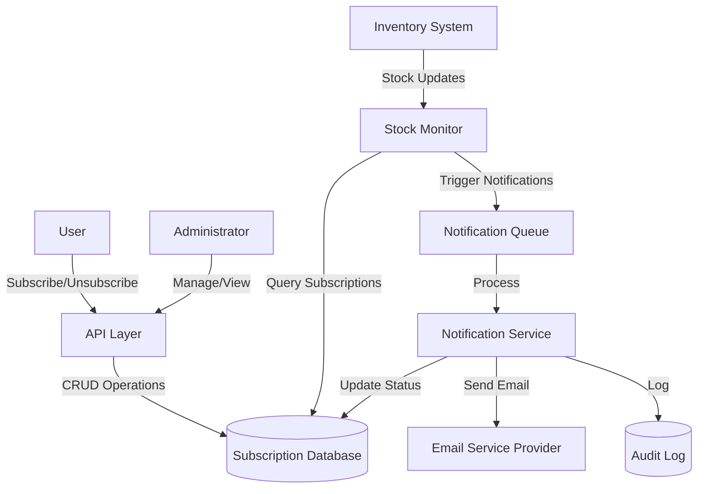

# Design Document: Inventory Alerts

## Overview

The Inventory Alerts system is a notification service that monitors product inventory levels and alerts subscribed users when out-of-stock items become available. The system consists of four main components:

1. **Subscription Management**: Handles user subscriptions and unsubscriptions
2. **Stock Monitoring**: Continuously tracks inventory levels and detects stock transitions
3. **Notification Service**: Sends email notifications to subscribed users
4. **Admin Interface**: Provides administrative tools for managing subscriptions and viewing analytics

The system operates asynchronously, with the stock monitor running as a background process that triggers notifications when stock changes are detected. Email delivery is handled through a queue-based system to ensure reliability and scalability.

## Architecture

### High-Level Architecture



### Component Interaction Flow

1. **Subscription Flow**:
   - User requests subscription via API
   - API validates input and checks for duplicates
   - Subscription record created in database
   - Confirmation email sent asynchronously

2. **Monitoring Flow**:
   - Stock Monitor polls inventory system periodically
   - Detects products transitioning from out-of-stock to in-stock
   - Queries database for active subscriptions
   - Enqueues notification jobs for each subscription

3. **Notification Flow**:
   - Notification Service processes jobs from queue
   - Generates personalized email content
   - Sends email via Email Service Provider
   - Updates subscription status in database
   - Logs delivery status to audit log

## Components and Interfaces

### 1. Subscription Manager

**Responsibilities**:
- Create and validate new subscriptions
- Remove subscriptions (user-initiated or system-initiated)
- Prevent duplicate subscriptions
- Query subscriptions by product or user

**Interface**:
```typescript
interface SubscriptionManager {
  // Create a new subscription
  createSubscription(userId: string, productId: string, email: string): Promise<Subscription>
  
  // Remove a subscription
  removeSubscription(subscriptionId: string): Promise<void>
  
  // Get all active subscriptions for a product
  getSubscriptionsByProduct(productId: string): Promise<Subscription[]>
  
  // Get all subscriptions for a user
  getSubscriptionsByUser(userId: string): Promise<Subscription[]>
  
  // Check if subscription exists
  subscriptionExists(userId: string, productId: string): Promise<boolean>
  
  // Mark subscription as notified
  markAsNotified(subscriptionId: string, notificationId: string): Promise<void>
}

interface Subscription {
  id: string
  userId: string
  productId: string
  email: string
  status: 'active' | 'notified' | 'cancelled' | 'failed'
  createdAt: Date
  notifiedAt?: Date
  notificationId?: string
}
```

### 2. Stock Monitor

**Responsibilities**:
- Poll inventory system for stock level changes
- Detect products transitioning to in-stock status
- Trigger notification process for affected subscriptions
- Handle monitoring errors gracefully

**Interface**:
```typescript
interface StockMonitor {
  // Start monitoring process
  start(intervalMinutes: number): void
  
  // Stop monitoring process
  stop(): void
  
  // Check stock levels and trigger notifications
  checkStockLevels(): Promise<StockCheckResult>
  
  // Get monitoring status
  getStatus(): MonitorStatus
}

interface StockCheckResult {
  productsChecked: number
  stockTransitions: StockTransition[]
  notificationsTriggered: number
  errors: Error[]
}

interface StockTransition {
  productId: string
  previousStock: number
  currentStock: number
  timestamp: Date
}

interface MonitorStatus {
  isRunning: boolean
  lastCheckTime: Date
  nextCheckTime: Date
  totalChecks: number
  totalErrors: number
}
```

### 3. Notification Service

**Responsibilities**:
- Process notification jobs from queue
- Generate email content with product details
- Send emails via Email Service Provider
- Handle delivery failures with retry logic
- Update subscription status after delivery

**Interface**:
```typescript
interface NotificationService {
  // Send notification for a subscription
  sendNotification(subscription: Subscription, product: Product): Promise<NotificationResult>
  
  // Process notification queue
  processQueue(): Promise<void>
  
  // Retry failed notifications
  retryFailed(notificationId: string): Promise<NotificationResult>
  
  // Get notification history
  getHistory(filters: NotificationFilters): Promise<NotificationRecord[]>
}

interface NotificationResult {
  success: boolean
  notificationId: string
  deliveredAt?: Date
  error?: Error
  retryCount: number
}

interface NotificationRecord {
  id: string
  subscriptionId: string
  productId: string
  email: string
  status: 'pending' | 'sent' | 'failed'
  sentAt?: Date
  error?: string
  retryCount: number
}

interface NotificationFilters {
  productId?: string
  email?: string
  status?: string
  startDate?: Date
  endDate?: Date
  limit?: number
}
```

### 4. Admin Interface

**Responsibilities**:
- Display subscription data with filtering
- Allow manual subscription cancellation
- Show notification statistics and history
- Provide system health monitoring

**Interface**:
```typescript
interface AdminInterface {
  // Get subscriptions with filters
  getSubscriptions(filters: SubscriptionFilters): Promise<SubscriptionList>
  
  // Cancel subscription manually
  cancelSubscription(subscriptionId: string, reason: string): Promise<void>
  
  // Get notification statistics
  getStatistics(timeRange: TimeRange): Promise<NotificationStatistics>
  
  // Get system health status
  getSystemHealth(): Promise<SystemHealth>
}

interface SubscriptionFilters {
  productId?: string
  email?: string
  status?: string
  startDate?: Date
  endDate?: Date
  limit?: number
  offset?: number
}

interface SubscriptionList {
  subscriptions: Subscription[]
  total: number
  page: number
  pageSize: number
}

interface NotificationStatistics {
  totalSent: number
  totalFailed: number
  totalPending: number
  averageDeliveryTime: number
  successRate: number
}

interface SystemHealth {
  monitorStatus: MonitorStatus
  queueSize: number
  databaseConnected: boolean
  emailServiceConnected: boolean
  lastError?: Error
}
```

## Data Models

### Database Schema

**Subscriptions Table**:
```sql
CREATE TABLE subscriptions (
  id VARCHAR(36) PRIMARY KEY,
  user_id VARCHAR(36) NOT NULL,
  product_id VARCHAR(36) NOT NULL,
  email VARCHAR(255) NOT NULL,
  status ENUM('active', 'notified', 'cancelled', 'failed') NOT NULL DEFAULT 'active',
  created_at TIMESTAMP NOT NULL DEFAULT CURRENT_TIMESTAMP,
  notified_at TIMESTAMP NULL,
  notification_id VARCHAR(36) NULL,
  updated_at TIMESTAMP NOT NULL DEFAULT CURRENT_TIMESTAMP ON UPDATE CURRENT_TIMESTAMP,
  
  INDEX idx_product_status (product_id, status),
  INDEX idx_user_product (user_id, product_id),
  INDEX idx_email (email),
  INDEX idx_status_created (status, created_at),
  
  UNIQUE KEY unique_user_product (user_id, product_id, status)
);
```

**Notifications Table**:
```sql
CREATE TABLE notifications (
  id VARCHAR(36) PRIMARY KEY,
  subscription_id VARCHAR(36) NOT NULL,
  product_id VARCHAR(36) NOT NULL,
  email VARCHAR(255) NOT NULL,
  status ENUM('pending', 'sent', 'failed') NOT NULL DEFAULT 'pending',
  sent_at TIMESTAMP NULL,
  error_message TEXT NULL,
  retry_count INT NOT NULL DEFAULT 0,
  created_at TIMESTAMP NOT NULL DEFAULT CURRENT_TIMESTAMP,
  updated_at TIMESTAMP NOT NULL DEFAULT CURRENT_TIMESTAMP ON UPDATE CURRENT_TIMESTAMP,
  
  INDEX idx_status (status),
  INDEX idx_subscription (subscription_id),
  INDEX idx_created (created_at),
  FOREIGN KEY (subscription_id) REFERENCES subscriptions(id) ON DELETE CASCADE
);
```

**Audit Log Table**:
```sql
CREATE TABLE audit_log (
  id VARCHAR(36) PRIMARY KEY,
  event_type ENUM('subscription_created', 'subscription_cancelled', 'notification_sent', 'notification_failed', 'stock_checked') NOT NULL,
  entity_id VARCHAR(36) NOT NULL,
  details JSON NULL,
  created_at TIMESTAMP NOT NULL DEFAULT CURRENT_TIMESTAMP,
  
  INDEX idx_event_type (event_type),
  INDEX idx_entity (entity_id),
  INDEX idx_created (created_at)
);
```

### Data Validation Rules

1. **Email Validation**: Must match RFC 5322 format
2. **Product ID**: Must exist in inventory system
3. **Stock Levels**: Must be non-negative integers
4. **Subscription Uniqueness**: One active subscription per user-product pair
5. **Retry Limits**: Maximum 3 retry attempts for failed notifications

## Correctness Properties

*A property is a characteristic or behavior that should hold true across all valid executions of a system—essentially, a formal statement about what the system should do. Properties serve as the bridge between human-readable specifications and machine-verifiable correctness guarantees.*


### Property 1: Subscription Creation Stores Correct Data
*For any* valid user ID, product ID, and email address, creating a subscription should result in a subscription record that contains exactly those values.
**Validates: Requirements 1.2**

### Property 2: Duplicate Subscriptions Are Prevented
*For any* user and product combination, attempting to create a subscription when an active subscription already exists should be rejected, and the subscription count should remain unchanged.
**Validates: Requirements 1.3**

### Property 3: Subscription Lifecycle Events Trigger Emails
*For any* subscription, both creation and cancellation events should trigger confirmation emails to the subscribed email address.
**Validates: Requirements 1.4, 2.2**

### Property 4: Invalid Email Addresses Are Rejected
*For any* string that does not match valid email format (RFC 5322), attempting to create a subscription should be rejected with a descriptive error.
**Validates: Requirements 1.5, 7.2**

### Property 5: Unsubscribe Removes Subscription
*For any* active subscription, calling the unsubscribe operation (either authenticated or via unsubscribe link) should result in the subscription being removed from active subscriptions.
**Validates: Requirements 2.1, 2.4**

### Property 6: Notification Emails Contain Required Information
*For any* notification email sent, the email content should include the product name, current stock level, product page link, and an unsubscribe link.
**Validates: Requirements 2.3, 4.2**

### Property 7: Stock Transitions Are Detected
*For any* product that transitions from out-of-stock (quantity < threshold) to in-stock (quantity >= threshold), the stock monitor should detect this transition and identify it for notification processing.
**Validates: Requirements 3.1**

### Property 8: All Subscriptions Are Identified for Stock Changes
*For any* product that becomes in-stock, querying for subscriptions should return all active subscriptions for that product.
**Validates: Requirements 3.2**

### Property 9: Monitor Errors Don't Stop Monitoring
*For any* error encountered during stock monitoring, the error should be logged and the monitoring process should continue without termination.
**Validates: Requirements 3.5**

### Property 10: All Subscribers Receive Notifications
*For any* product with active subscriptions that becomes in-stock, all subscribed users should receive notification emails.
**Validates: Requirements 4.1**

### Property 11: Notifications Update Subscription Status
*For any* successfully sent notification, the corresponding subscription should be marked with status 'notified' and include the notification timestamp.
**Validates: Requirements 4.3, 5.1**

### Property 12: Failed Notifications Retry with Backoff
*For any* notification that fails to send, the system should retry up to 3 times with exponentially increasing delays between attempts.
**Validates: Requirements 4.4**

### Property 13: Exhausted Retries Are Logged and Marked Failed
*For any* notification where all 3 retry attempts fail, the notification should be marked as 'failed' and an error log entry should be created.
**Validates: Requirements 4.5**

### Property 14: Product Discontinuation Cancels All Subscriptions
*For any* product that is marked as discontinued, all active subscriptions for that product should be cancelled.
**Validates: Requirements 5.4**

### Property 15: Cancelled Subscriptions Trigger User Notifications
*For any* subscription cancelled due to product discontinuation, a notification email should be sent to the user explaining the cancellation.
**Validates: Requirements 5.5**

### Property 16: Admin Queries Return Complete Data
*For any* admin query for subscriptions or notification history, all returned records should include the required fields (email, product ID, timestamps, status).
**Validates: Requirements 6.1, 6.5**

### Property 17: Subscription Filtering Works Correctly
*For any* filter criteria (product ID, email, status), the returned subscriptions should match all specified criteria, and no non-matching subscriptions should be returned.
**Validates: Requirements 6.2**

### Property 18: Admin Cancellation Removes and Notifies
*For any* subscription cancelled by an administrator, the subscription should be removed and a cancellation notification should be sent to the user.
**Validates: Requirements 6.3**

### Property 19: Notification Statistics Are Accurate
*For any* set of notifications in the system, the calculated statistics (total sent, failed, pending) should exactly match the count of notifications in each status.
**Validates: Requirements 6.4**

### Property 20: Invalid Product IDs Are Rejected
*For any* product ID that does not exist in the inventory system, attempting to create a subscription should be rejected with a descriptive error.
**Validates: Requirements 7.1**

### Property 21: Stock Levels Must Be Non-Negative
*For any* stock level update, if the value is negative or not an integer, the update should be rejected with a descriptive error.
**Validates: Requirements 7.3**

### Property 22: Invalid Data Returns Descriptive Errors
*For any* operation with invalid input data (invalid email, non-existent product, negative stock), the system should reject the operation and return an error message that describes the validation failure.
**Validates: Requirements 7.4**

### Property 23: User Inputs Are Sanitized
*For any* user input containing potentially malicious content (SQL injection, XSS), the input should be sanitized before processing or storage.
**Validates: Requirements 7.5**

### Property 24: Rate Limiting Prevents Quota Exhaustion
*For any* time window, the number of emails sent should not exceed the configured rate limit, even when more notifications are queued.
**Validates: Requirements 8.5**

## Error Handling

### Error Categories

1. **Validation Errors**:
   - Invalid email format
   - Non-existent product ID
   - Negative stock levels
   - Malformed input data
   - **Response**: Return 400 Bad Request with descriptive error message

2. **Duplicate Errors**:
   - Subscription already exists
   - **Response**: Return 409 Conflict with existing subscription details

3. **Not Found Errors**:
   - Subscription doesn't exist
   - Product not found
   - **Response**: Return 404 Not Found with resource identifier

4. **External Service Errors**:
   - Email service unavailable
   - Inventory system timeout
   - Database connection failure
   - **Response**: Retry with exponential backoff, log error, return 503 Service Unavailable if retries exhausted

5. **Rate Limiting Errors**:
   - Email quota exceeded
   - Too many requests
   - **Response**: Queue for later processing, return 429 Too Many Requests to API clients

### Error Recovery Strategies

1. **Notification Failures**:
   - Retry up to 3 times with exponential backoff (1s, 2s, 4s)
   - Mark as failed after exhausting retries
   - Create audit log entry
   - Alert administrators for manual review

2. **Stock Monitor Failures**:
   - Log error with full context
   - Continue monitoring other products
   - Alert if error rate exceeds threshold
   - Implement circuit breaker for inventory system calls

3. **Database Failures**:
   - Implement connection pooling with retry logic
   - Use read replicas for queries when available
   - Queue write operations for retry
   - Alert administrators for persistent failures

4. **Email Service Failures**:
   - Switch to backup email provider if available
   - Queue notifications for later delivery
   - Implement circuit breaker to prevent cascading failures
   - Monitor delivery rates and alert on anomalies

### Logging and Monitoring

All errors should be logged with:
- Timestamp
- Error type and message
- Context (user ID, product ID, subscription ID)
- Stack trace for unexpected errors
- Request ID for tracing

Critical errors should trigger alerts:
- Email service unavailable for > 5 minutes
- Database connection failures
- Error rate > 5% over 10-minute window
- Queue size exceeding capacity threshold

## Testing Strategy

### Dual Testing Approach

The Inventory Alerts system requires both unit testing and property-based testing to ensure comprehensive coverage:

- **Unit tests**: Verify specific examples, edge cases, and error conditions
- **Property tests**: Verify universal properties across all inputs

Together, these approaches provide comprehensive coverage where unit tests catch concrete bugs and property tests verify general correctness.

### Property-Based Testing

We will use **fast-check** (for TypeScript/JavaScript) as our property-based testing library. Each property test will:

- Run a minimum of 100 iterations with randomly generated inputs
- Reference its corresponding design document property
- Use the tag format: **Feature: inventory-alerts, Property {number}: {property_text}**

**Example Property Test Structure**:
```typescript
// Feature: inventory-alerts, Property 2: Duplicate Subscriptions Are Prevented
test('duplicate subscriptions are prevented', async () => {
  await fc.assert(
    fc.asyncProperty(
      fc.record({
        userId: fc.uuid(),
        productId: fc.uuid(),
        email: fc.emailAddress()
      }),
      async (data) => {
        // Create first subscription
        const sub1 = await subscriptionManager.createSubscription(
          data.userId, 
          data.productId, 
          data.email
        );
        
        // Attempt duplicate
        await expect(
          subscriptionManager.createSubscription(
            data.userId, 
            data.productId, 
            data.email
          )
        ).rejects.toThrow();
        
        // Verify only one subscription exists
        const subs = await subscriptionManager.getSubscriptionsByUser(data.userId);
        expect(subs.length).toBe(1);
      }
    ),
    { numRuns: 100 }
  );
});
```

### Unit Testing Focus Areas

Unit tests should focus on:

1. **Specific Examples**:
   - Subscription creation with known valid data
   - Unsubscribe flow with specific user
   - Stock transition from 0 to 5 units

2. **Edge Cases**:
   - Empty email string
   - Product ID with special characters
   - Stock level exactly at threshold
   - Subscription created at system boundary times

3. **Error Conditions**:
   - Email service returns 500 error
   - Database connection timeout
   - Invalid JSON in notification payload
   - Rate limit exactly at boundary

4. **Integration Points**:
   - Email service integration
   - Inventory system API calls
   - Database transactions
   - Queue processing

### Test Coverage Goals

- **Code Coverage**: Minimum 80% line coverage
- **Property Coverage**: All 24 correctness properties implemented as property tests
- **Edge Case Coverage**: All identified edge cases covered by unit tests
- **Error Path Coverage**: All error handling paths tested

### Testing Tools

- **Property Testing**: fast-check (TypeScript/JavaScript)
- **Unit Testing**: Jest or Vitest
- **Integration Testing**: Supertest for API testing
- **Mocking**: Jest mocks for external services
- **Database Testing**: In-memory database or test containers

### Continuous Testing

- Run unit tests on every commit
- Run property tests in CI/CD pipeline
- Run integration tests before deployment
- Monitor test execution time and optimize slow tests
- Maintain test data generators for consistent property testing
