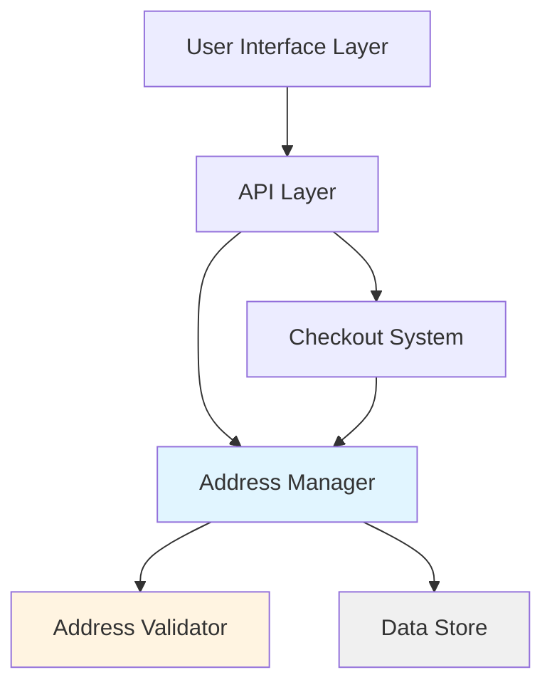

# Design Document: Multi-Address Management

## Overview

The multi-address management system provides users with the ability to save, manage, and select from multiple shipping addresses. The system is built around a core Address Manager that handles CRUD operations, default address management, and integration with the checkout process. Address validation ensures data integrity before persistence, and the system maintains a clear separation between address management logic and storage mechanisms.

The design emphasizes user convenience through automatic default address selection, clear validation feedback, and seamless checkout integration. The architecture supports extensibility for future enhancements such as address verification services or international address format support.

## Architecture

The system follows a layered architecture with clear separation of concerns:



**Layer Responsibilities:**

- **User Interface Layer**: Presents address management forms, lists, and checkout address selection
- **API Layer**: Exposes RESTful endpoints for address operations
- **Address Manager**: Core business logic for CRUD operations and default address management
- **Address Validator**: Validates address data format and completeness
- **Data Store**: Persists address data with user associations
- **Checkout System**: Integrates address selection into the order process

## Components and Interfaces

### Address Manager

The Address Manager is the central component responsible for all address operations.

**Interface:**

```typescript
interface AddressManager {
  createAddress(userId: string, address: AddressInput): Result<Address, ValidationError[]>
  getAddresses(userId: string): Result<Address[], Error>
  getAddress(userId: string, addressId: string): Result<Address, Error>
  updateAddress(userId: string, addressId: string, updates: AddressInput): Result<Address, ValidationError[]>
  deleteAddress(userId: string, addressId: string): Result<void, Error>
  setDefaultAddress(userId: string, addressId: string): Result<void, Error>
  getDefaultAddress(userId: string): Result<Address | null, Error>
}
```

**Responsibilities:**
- Coordinate address CRUD operations
- Enforce default address rules (exactly one default when multiple addresses exist)
- Delegate validation to Address Validator
- Persist changes through Data Store
- Handle automatic default assignment for first address
- Handle automatic default reassignment when default is deleted

### Address Validator

The Address Validator ensures address data meets format and completeness requirements.

**Interface:**

```typescript
interface AddressValidator {
  validate(address: AddressInput): ValidationResult
  validatePostalCode(postalCode: string, country: string): boolean
  validateRequiredFields(address: AddressInput): ValidationError[]
}

type ValidationResult = {
  isValid: boolean
  errors: ValidationError[]
}

type ValidationError = {
  field: string
  message: string
}
```

**Validation Rules:**
- Required fields: street address, city, postal code, country
- Optional fields: apartment/unit, company name, phone number, state/province
- Postal code format validation by country:
  - US: 5 digits or 5+4 format (12345 or 12345-6789)
  - Canada: A1A 1A1 format
  - UK: Various formats (e.g., SW1A 1AA)
- All required fields must contain non-whitespace content
- Field length limits to prevent abuse

### Data Store Interface

The Data Store abstracts persistence mechanisms.

**Interface:**

```typescript
interface AddressDataStore {
  save(userId: string, address: Address): Promise<Address>
  findById(userId: string, addressId: string): Promise<Address | null>
  findByUserId(userId: string): Promise<Address[]>
  update(userId: string, addressId: string, address: Address): Promise<Address>
  delete(userId: string, addressId: string): Promise<void>
  findDefaultAddress(userId: string): Promise<Address | null>
}
```

**Implementation Notes:**
- Supports both SQL and NoSQL backends
- Ensures atomic operations for default address updates
- Maintains user-address associations
- Handles concurrent access safely

### Checkout Integration

The Checkout System integrates address selection into the order flow.

**Interface:**

```typescript
interface CheckoutAddressService {
  getAvailableAddresses(userId: string): Promise<AddressSelectionData>
  selectAddressForOrder(orderId: string, addressId: string): Promise<void>
  saveNewCheckoutAddress(userId: string, address: AddressInput, saveForFuture: boolean): Promise<Address>
}

type AddressSelectionData = {
  addresses: Address[]
  defaultAddressId: string | null
}
```

**Integration Points:**
- Pre-select default address when checkout begins
- Allow address selection without changing default status
- Offer to save new addresses entered during checkout
- Pass selected address to order processing

## Data Models

### Address Model

```typescript
type Address = {
  id: string
  userId: string
  street: string
  apartment?: string
  city: string
  state?: string
  postalCode: string
  country: string
  companyName?: string
  phoneNumber?: string
  isDefault: boolean
  createdAt: Date
  updatedAt: Date
}

type AddressInput = {
  street: string
  apartment?: string
  city: string
  state?: string
  postalCode: string
  country: string
  companyName?: string
  phoneNumber?: string
}
```

**Field Descriptions:**
- `id`: Unique identifier for the address
- `userId`: Reference to the user who owns this address
- `street`: Street address (required)
- `apartment`: Apartment, suite, or unit number (optional)
- `city`: City name (required)
- `state`: State or province (optional, required for some countries)
- `postalCode`: Postal or ZIP code (required)
- `country`: Country code or name (required)
- `companyName`: Company name for business addresses (optional)
- `phoneNumber`: Contact phone number (optional)
- `isDefault`: Whether this is the user's default address
- `createdAt`: Timestamp of address creation
- `updatedAt`: Timestamp of last modification

### Default Address Rules

The system enforces these invariants:
1. When a user has exactly one address, it must be the default
2. When a user has multiple addresses, exactly one must be the default
3. When a user has zero addresses, no default exists
4. When the default address is deleted and other addresses exist, another address becomes the default automatically

**Default Selection Algorithm (when current default is deleted):**
1. Select the most recently created address
2. If creation timestamps are identical, select by lexicographic order of address ID


## Correctness Properties

A property is a characteristic or behavior that should hold true across all valid executions of a system—essentially, a formal statement about what the system should do. Properties serve as the bridge between human-readable specifications and machine-verifiable correctness guarantees.

### Property 1: Address Creation and Retrieval

*For any* valid address input, when a user creates an address, retrieving the user's address list should include an address with all the same field values.

**Validates: Requirements 1.1, 2.1, 2.4**

### Property 2: Invalid Address Rejection

*For any* address input with invalid data (missing required fields, invalid postal code format, or whitespace-only required fields), attempting to create or update an address should be rejected with validation errors that specify which fields are invalid.

**Validates: Requirements 1.2, 1.4, 3.2, 6.2, 6.3**

### Property 3: First Address is Default

*For any* user with zero addresses, when they create their first address, that address should be marked as the default address.

**Validates: Requirements 1.3**

### Property 4: Complete Address Retrieval

*For any* set of addresses created for a user (including addresses with optional fields), retrieving the address list should return all addresses with all their fields intact.

**Validates: Requirements 2.1, 2.4**

### Property 5: Empty Address List

*For any* user with no saved addresses, retrieving their address list should return an empty list.

**Validates: Requirements 2.3**

### Property 6: Address Update Persistence

*For any* existing address and valid update data, when a user updates the address, retrieving that address should reflect all the changes.

**Validates: Requirements 3.1, 8.1, 8.2**

### Property 7: Default Status Preservation During Update

*For any* address update that doesn't explicitly change the default status, the address's isDefault field should remain unchanged after the update.

**Validates: Requirements 3.3**

### Property 8: Non-Existent Address Error Handling

*For any* non-existent address ID, attempting to update or delete that address should return an error indicating the address was not found.

**Validates: Requirements 3.4, 4.4**

### Property 9: Non-Default Address Deletion

*For any* user with multiple addresses, when a non-default address is deleted, it should no longer appear in the user's address list and the default address should remain unchanged.

**Validates: Requirements 4.1**

### Property 10: Last Address Deletion

*For any* user with exactly one address, deleting that address should result in an empty address list.

**Validates: Requirements 4.2**

### Property 11: Automatic Default Reassignment

*For any* user with multiple addresses, when the default address is deleted, exactly one of the remaining addresses should automatically become the new default.

**Validates: Requirements 4.3, 5.3**

### Property 12: Exclusive Default Status

*For any* user with multiple addresses, when an address is designated as default, exactly one address should have isDefault=true and all others should have isDefault=false.

**Validates: Requirements 5.1, 5.2**

### Property 13: Default Address Invariant

*For any* user with one or more addresses, exactly one address should be marked as default at all times.

**Validates: Requirements 5.2**

### Property 14: Checkout Default Pre-Selection

*For any* user with a default address, when beginning checkout, the checkout system should pre-select the default address.

**Validates: Requirements 5.4, 7.2**

### Property 15: Postal Code Format Validation

*For any* address with a postal code, validation should accept the postal code if and only if it matches the format standard for the specified country (US: 5 or 5+4 digits, Canada: A1A 1A1, UK: valid UK postcode format).

**Validates: Requirements 6.1, 6.5**

### Property 16: Optional Fields Acceptance

*For any* address with valid required fields, the address should be accepted regardless of whether optional fields (apartment, company name, phone number) are present or absent.

**Validates: Requirements 6.4**

### Property 17: Checkout Address Availability

*For any* user with saved addresses, when beginning checkout, all saved addresses should be available for selection.

**Validates: Requirements 7.1**

### Property 18: Checkout Selection Independence

*For any* user selecting a non-default address during checkout, the default address setting should remain unchanged after checkout completion.

**Validates: Requirements 7.3**

### Property 19: User Address Isolation

*For any* two different users, addresses created by one user should never appear in the other user's address list.

**Validates: Requirements 8.3**

## Error Handling

The system implements comprehensive error handling across all operations:

### Validation Errors

**ValidationError Type:**
```typescript
type ValidationError = {
  field: string
  message: string
  code: string
}
```

**Common Validation Error Codes:**
- `REQUIRED_FIELD_MISSING`: A required field is missing or empty
- `INVALID_POSTAL_CODE`: Postal code doesn't match country format
- `WHITESPACE_ONLY`: Required field contains only whitespace
- `INVALID_COUNTRY`: Country code is not recognized
- `FIELD_TOO_LONG`: Field exceeds maximum length

### Operation Errors

**Error Types:**
```typescript
type AddressNotFoundError = {
  code: 'ADDRESS_NOT_FOUND'
  message: string
  addressId: string
}

type StorageError = {
  code: 'STORAGE_ERROR'
  message: string
  operation: string
}

type UnauthorizedError = {
  code: 'UNAUTHORIZED'
  message: string
}
```

### Error Handling Strategies

1. **Validation Errors**: Return immediately with descriptive field-level errors before attempting persistence
2. **Not Found Errors**: Return specific error when address ID doesn't exist or doesn't belong to user
3. **Storage Errors**: Log detailed error information, return generic error to user, maintain data consistency
4. **Concurrent Modification**: Use optimistic locking or transactions to prevent race conditions
5. **Partial Failures**: Ensure atomic operations - either complete success or complete rollback

### Error Response Format

All API endpoints return errors in a consistent format:

```typescript
type ErrorResponse = {
  success: false
  error: {
    code: string
    message: string
    details?: ValidationError[] | Record<string, any>
  }
}
```

## Testing Strategy

The testing strategy employs both unit tests and property-based tests to ensure comprehensive coverage of the multi-address management system.

### Property-Based Testing

Property-based tests validate universal properties across randomly generated inputs. We will use **fast-check** (for TypeScript/JavaScript) as the property-based testing library.

**Configuration:**
- Minimum 100 iterations per property test
- Each test tagged with feature name and property number
- Tag format: `Feature: multi-address-management, Property {N}: {property description}`

**Property Test Coverage:**
- Address creation and retrieval (Property 1)
- Validation rejection for invalid inputs (Property 2)
- First address default assignment (Property 3)
- Complete data retrieval (Property 4)
- Update persistence (Property 6)
- Default status preservation (Property 7)
- Error handling for non-existent addresses (Property 8)
- Deletion operations (Properties 9, 10, 11)
- Default address exclusivity (Properties 12, 13)
- Postal code validation (Property 15)
- Optional fields handling (Property 16)
- User isolation (Property 19)

**Generator Strategy:**
- Generate random valid addresses with all required fields
- Generate random invalid addresses (missing fields, bad postal codes, whitespace)
- Generate random user IDs for isolation testing
- Generate addresses with and without optional fields
- Generate postal codes for different countries (US, Canada, UK)

### Unit Testing

Unit tests focus on specific examples, edge cases, and integration points.

**Test Categories:**

1. **Address CRUD Operations**
   - Create address with all fields
   - Create address with only required fields
   - Update specific fields
   - Delete address and verify removal
   - Retrieve single address by ID

2. **Default Address Management**
   - Set default on multi-address account
   - Verify only one default exists
   - Delete default and verify reassignment
   - First address becomes default automatically

3. **Validation Edge Cases**
   - Empty string vs null vs whitespace
   - Boundary values for field lengths
   - Special characters in address fields
   - Various postal code formats per country

4. **Checkout Integration**
   - Pre-select default address
   - Select non-default address
   - Save new address during checkout
   - Handle user with no addresses

5. **Error Conditions**
   - Update non-existent address
   - Delete non-existent address
   - Invalid user ID
   - Storage failure scenarios

6. **Concurrent Operations**
   - Simultaneous default address changes
   - Concurrent address creation
   - Race conditions in default reassignment

### Integration Testing

Integration tests verify the system works correctly with external dependencies:

- Database persistence and retrieval
- Checkout system integration
- API endpoint behavior
- Transaction handling and rollback

### Test Data Management

- Use factories to generate test addresses
- Maintain separate test database or use transactions with rollback
- Clean up test data after each test
- Use realistic but anonymized address data
