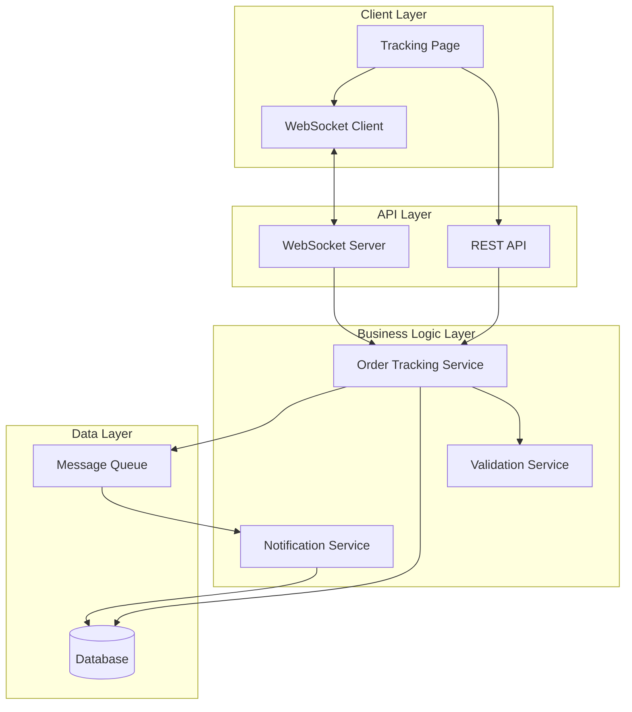

# Design Document: Order Tracking System

## Overview

The Order Tracking System provides real-time order status updates to customers through a web-based tracking page and email notifications. The system maintains a complete history of status changes and allows administrators to update order statuses. The architecture uses WebSocket connections for real-time updates, an event-driven notification system, and a RESTful API for order management.

## Architecture

The system follows a layered architecture with clear separation of concerns:



**Key Architectural Decisions:**

1. **WebSocket for Real-Time Updates**: WebSocket connections provide bidirectional, low-latency communication for pushing status updates to clients
2. **Event-Driven Notifications**: Status changes publish events to a message queue, decoupling notification delivery from status updates
3. **Optimistic UI Updates**: The tracking page updates immediately on status change, with server confirmation following
4. **Status History as Append-Only Log**: Status changes are never modified or deleted, ensuring complete audit trail

## Components and Interfaces

### Order Tracking Service

The core service responsible for managing order status and history.

**Interface:**
```typescript
interface OrderTrackingService {
  // Retrieve current order status
  getOrderStatus(orderId: string): Promise<OrderStatus>
  
  // Update order status (admin only)
  updateOrderStatus(
    orderId: string, 
    newStatus: StatusType, 
    adminId: string,
    notes?: string
  ): Promise<StatusUpdate>
  
  // Get complete status history
  getStatusHistory(orderId: string): Promise<StatusHistory[]>
  
  // Validate status transition
  validateTransition(
    currentStatus: StatusType, 
    newStatus: StatusType,
    isPrivileged: boolean
  ): boolean
}
```

**Responsibilities:**
- Validate status transitions using defined rules
- Record status changes in the database
- Publish status change events to the message queue
- Retrieve order status and history information

### Notification Service

Handles email notifications for status changes.

**Interface:**
```typescript
interface NotificationService {
  // Send email notification for status change
  sendStatusChangeEmail(
    orderId: string,
    customerEmail: string,
    statusUpdate: StatusUpdate
  ): Promise<void>
  
  // Batch notifications within time window
  batchNotifications(
    orderId: string,
    updates: StatusUpdate[]
  ): Promise<void>
  
  // Retry failed notifications
  retryFailedNotification(
    notificationId: string
  ): Promise<void>
}
```

**Responsibilities:**
- Listen to status change events from message queue
- Format and send email notifications
- Implement retry logic for failed deliveries
- Batch multiple updates to prevent email flooding

### Validation Service

Enforces business rules for status transitions.

**Interface:**
```typescript
interface ValidationService {
  // Check if transition is valid
  isValidTransition(
    from: StatusType,
    to: StatusType,
    isPrivileged: boolean
  ): boolean
  
  // Get allowed next statuses
  getAllowedTransitions(
    currentStatus: StatusType,
    isPrivileged: boolean
  ): StatusType[]
}
```

**Status Transition Rules:**
```
pending -> processing (any user)
pending -> cancelled (admin only)
processing -> shipped (admin only)
processing -> cancelled (admin only)
shipped -> delivered (admin only)
shipped -> returned (admin only)
delivered -> returned (privileged admin only)
```

### WebSocket Server

Manages real-time connections and pushes updates to clients.

**Interface:**
```typescript
interface WebSocketServer {
  // Register client connection for order
  subscribe(orderId: string, connectionId: string): void
  
  // Remove client connection
  unsubscribe(connectionId: string): void
  
  // Push update to all subscribers of an order
  pushUpdate(orderId: string, update: StatusUpdate): void
  
  // Handle connection lifecycle
  onConnect(connectionId: string): void
  onDisconnect(connectionId: string): void
  onReconnect(connectionId: string): void
}
```

**Responsibilities:**
- Maintain active WebSocket connections
- Map order IDs to connected clients
- Push status updates to relevant clients
- Handle connection failures and reconnection

### REST API

Provides HTTP endpoints for order tracking operations.

**Endpoints:**
```
GET /api/orders/{orderId}/status
  - Returns current order status
  - Public endpoint (requires order ID only)

GET /api/orders/{orderId}/history
  - Returns complete status history
  - Public endpoint (requires order ID only)

POST /api/orders/{orderId}/status
  - Updates order status
  - Admin-only endpoint (requires authentication)
  - Body: { status: StatusType, notes?: string }

GET /api/orders/{orderId}/tracking
  - Returns full tracking page data
  - Public endpoint (requires order ID only)
```

## Data Models

### Order Status

```typescript
interface OrderStatus {
  orderId: string
  currentStatus: StatusType
  lastUpdated: Date
  estimatedDelivery?: Date
  trackingNumber?: string
}

enum StatusType {
  PENDING = 'pending',
  PROCESSING = 'processing',
  SHIPPED = 'shipped',
  DELIVERED = 'delivered',
  CANCELLED = 'cancelled',
  RETURNED = 'returned'
}
```

### Status History Entry

```typescript
interface StatusHistoryEntry {
  id: string
  orderId: string
  previousStatus: StatusType | null
  newStatus: StatusType
  timestamp: Date
  updatedBy: string  // 'system' or admin ID
  notes?: string
}
```

### Status Update Event

```typescript
interface StatusUpdateEvent {
  orderId: string
  statusUpdate: StatusHistoryEntry
  customerEmail: string
  orderDetails: {
    items: OrderItem[]
    deliveryAddress: Address
  }
}
```

### Order Details

```typescript
interface OrderDetails {
  orderId: string
  customerId: string
  customerEmail: string
  items: OrderItem[]
  deliveryAddress: Address
  currentStatus: StatusType
  statusHistory: StatusHistoryEntry[]
  createdAt: Date
}

interface OrderItem {
  productId: string
  productName: string
  quantity: number
  price: number
}

interface Address {
  street: string
  city: string
  state: string
  postalCode: string
  country: string
}
```

## Correctness Properties

*A property is a characteristic or behavior that should hold true across all valid executions of a system—essentially, a formal statement about what the system should do. Properties serve as the bridge between human-readable specifications and machine-verifiable correctness guarantees.*


### Property 1: Order Retrieval Returns Correct Information

*For any* valid order in the system, retrieving that order by its ID should return the order with its current status, timestamp, and all order details matching what was stored.

**Validates: Requirements 1.1, 1.2, 1.3**

### Property 2: Invalid Order IDs Return Errors

*For any* invalid or non-existent order identifier, attempting to retrieve order information should return a descriptive error message and not return order data.

**Validates: Requirements 1.4**

### Property 3: Status Changes Create Complete History Entries

*For any* order status change, the system should create a history entry containing the previous status, new status, timestamp, updater ID, and optional notes.

**Validates: Requirements 4.1, 4.2**

### Property 4: Status History Maintains Chronological Order

*For any* order with multiple status changes, retrieving the status history should return all entries sorted by timestamp in chronological order.

**Validates: Requirements 4.3**

### Property 5: Status Changes Trigger Email Notifications

*For any* order status change, the system should send an email notification to the customer's registered email address containing the order ID, new status, timestamp, and any notes.

**Validates: Requirements 2.1, 2.2, 5.5**

### Property 6: Failed Email Notifications Are Logged and Retried

*For any* email notification that fails to send, the system should log the failure and attempt to retry according to the defined retry policy.

**Validates: Requirements 2.3**

### Property 7: Rapid Status Changes Are Batched

*For any* order with multiple status changes occurring within the batching time window, the system should send a single batched email notification instead of multiple individual emails.

**Validates: Requirements 2.4**

### Property 8: Tracking Page Contains Required Order Details

*For any* valid order, the tracking page response should include all order details: items with quantities, delivery address, current status, and status history.

**Validates: Requirements 3.2**

### Property 9: Real-Time Updates Are Pushed to Connected Clients

*For any* order with active WebSocket connections, when the status changes, all connected clients should automatically receive the status update without requiring a page refresh.

**Validates: Requirements 3.4, 6.1, 6.2**

### Property 10: Disconnected Clients Receive Missed Updates on Reconnection

*For any* client that disconnects and then reconnects, the system should synchronize and deliver any status updates that occurred during the disconnection period.

**Validates: Requirements 6.4**

### Property 11: Connection Interruptions Trigger Automatic Reconnection

*For any* WebSocket connection that is interrupted, the client should automatically attempt to reconnect to the server.

**Validates: Requirements 6.3**

### Property 12: Status Transitions Are Validated

*For any* status update request, the system should validate that the transition from the current status to the new status is allowed according to the defined transition rules, and reject invalid transitions with a descriptive error message.

**Validates: Requirements 5.4, 7.2, 7.3**

### Property 13: Administrator Permissions Are Validated

*For any* status update request, the system should verify that the requester has administrator permissions before allowing the update to proceed.

**Validates: Requirements 5.1**

### Property 14: Administrator Updates Change Status and Create History

*For any* valid administrator status update, the system should both change the order's current status and create a corresponding entry in the status history.

**Validates: Requirements 5.2**

### Property 15: Optional Notes Can Be Included in Updates

*For any* status update, the system should accept and store optional notes in the history entry, and updates should succeed whether notes are provided or not.

**Validates: Requirements 5.3**

### Property 16: Privileged Administrators Can Make Exceptional Transitions

*For any* status transition that is normally restricted, privileged administrators should be able to perform the transition while non-privileged users cannot.

**Validates: Requirements 7.4**

## Error Handling

### Error Categories

**1. Invalid Order ID**
- Return 404 Not Found with message: "Order not found"
- Log the attempted access for security monitoring

**2. Invalid Status Transition**
- Return 400 Bad Request with message: "Invalid status transition from {current} to {new}"
- Include list of valid next statuses in error response

**3. Unauthorized Access**
- Return 403 Forbidden with message: "Administrator privileges required"
- Log unauthorized access attempts

**4. Email Delivery Failure**
- Log error with full context (order ID, email address, error details)
- Retry with exponential backoff: 1min, 5min, 15min, 1hr, 6hr
- After 5 failed attempts, alert operations team

**5. WebSocket Connection Failure**
- Client automatically attempts reconnection with exponential backoff
- Maximum 10 reconnection attempts before requiring manual refresh
- Display connection status indicator to user

**6. Database Errors**
- Return 500 Internal Server Error with generic message
- Log full error details server-side
- Implement circuit breaker pattern for database connections

### Error Response Format

```typescript
interface ErrorResponse {
  error: {
    code: string
    message: string
    details?: Record<string, any>
    timestamp: Date
  }
}
```

## Testing Strategy

The testing strategy employs both unit tests and property-based tests to ensure comprehensive coverage of the order tracking system.

### Unit Testing Approach

Unit tests focus on specific examples, edge cases, and integration points:

**Specific Examples:**
- Test status transition from "pending" to "processing" succeeds
- Test email notification contains correct order details
- Test tracking page displays order with 3 items correctly

**Edge Cases:**
- Empty order history (newly created order)
- Order with single item vs. multiple items
- Status update with maximum length notes field
- Concurrent status updates to same order

**Integration Points:**
- WebSocket server correctly routes updates to subscribed clients
- Message queue publishes and consumes status change events
- Database transactions maintain consistency during status updates

### Property-Based Testing Approach

Property tests verify universal properties across randomized inputs using a property-based testing library. Each test should run a minimum of 100 iterations.

**Test Configuration:**
- Use **fast-check** (for TypeScript/JavaScript) or **Hypothesis** (for Python)
- Minimum 100 iterations per property test
- Each test tagged with: **Feature: order-tracking, Property {N}: {property description}**

**Property Test Examples:**

```typescript
// Property 1: Order Retrieval
test('Feature: order-tracking, Property 1: Order retrieval returns correct information', () => {
  fc.assert(
    fc.property(
      orderGenerator(),
      (order) => {
        const stored = storeOrder(order);
        const retrieved = getOrderStatus(order.orderId);
        return (
          retrieved.orderId === order.orderId &&
          retrieved.currentStatus === order.currentStatus &&
          retrieved.lastUpdated !== null
        );
      }
    ),
    { numRuns: 100 }
  );
});

// Property 3: Status Changes Create History
test('Feature: order-tracking, Property 3: Status changes create complete history entries', () => {
  fc.assert(
    fc.property(
      orderGenerator(),
      statusTypeGenerator(),
      fc.option(fc.string()),
      (order, newStatus, notes) => {
        const previousStatus = order.currentStatus;
        updateOrderStatus(order.orderId, newStatus, 'admin-123', notes);
        const history = getStatusHistory(order.orderId);
        const latestEntry = history[history.length - 1];
        
        return (
          latestEntry.previousStatus === previousStatus &&
          latestEntry.newStatus === newStatus &&
          latestEntry.timestamp !== null &&
          latestEntry.updatedBy === 'admin-123' &&
          (notes ? latestEntry.notes === notes : true)
        );
      }
    ),
    { numRuns: 100 }
  );
});
```

**Generator Functions:**

Property tests require generator functions to create random test data:

```typescript
// Generate random orders
function orderGenerator() {
  return fc.record({
    orderId: fc.uuid(),
    customerId: fc.uuid(),
    customerEmail: fc.emailAddress(),
    currentStatus: statusTypeGenerator(),
    items: fc.array(orderItemGenerator(), { minLength: 1, maxLength: 10 }),
    deliveryAddress: addressGenerator(),
    createdAt: fc.date()
  });
}

// Generate random status types
function statusTypeGenerator() {
  return fc.constantFrom(
    'pending',
    'processing',
    'shipped',
    'delivered',
    'cancelled',
    'returned'
  );
}

// Generate random order items
function orderItemGenerator() {
  return fc.record({
    productId: fc.uuid(),
    productName: fc.string({ minLength: 1, maxLength: 100 }),
    quantity: fc.integer({ min: 1, max: 100 }),
    price: fc.float({ min: 0.01, max: 10000, noNaN: true })
  });
}
```

### Test Coverage Goals

- **Unit Test Coverage**: Minimum 80% code coverage
- **Property Test Coverage**: All 16 correctness properties implemented as property tests
- **Integration Test Coverage**: All API endpoints and WebSocket events
- **End-to-End Tests**: Critical user flows (view tracking page, receive email notification)

### Testing Best Practices

1. **Avoid Over-Testing with Unit Tests**: Property tests handle comprehensive input coverage, so unit tests should focus on specific examples and edge cases rather than exhaustive input combinations
2. **Test One Property Per Test**: Each property-based test should validate exactly one correctness property
3. **Use Meaningful Generators**: Ensure generators produce realistic test data that exercises actual system behavior
4. **Verify Side Effects**: Property tests should check both return values and side effects (database changes, events published, emails sent)
5. **Mock External Dependencies**: Mock email service, message queue, and database in property tests to ensure fast, reliable execution
