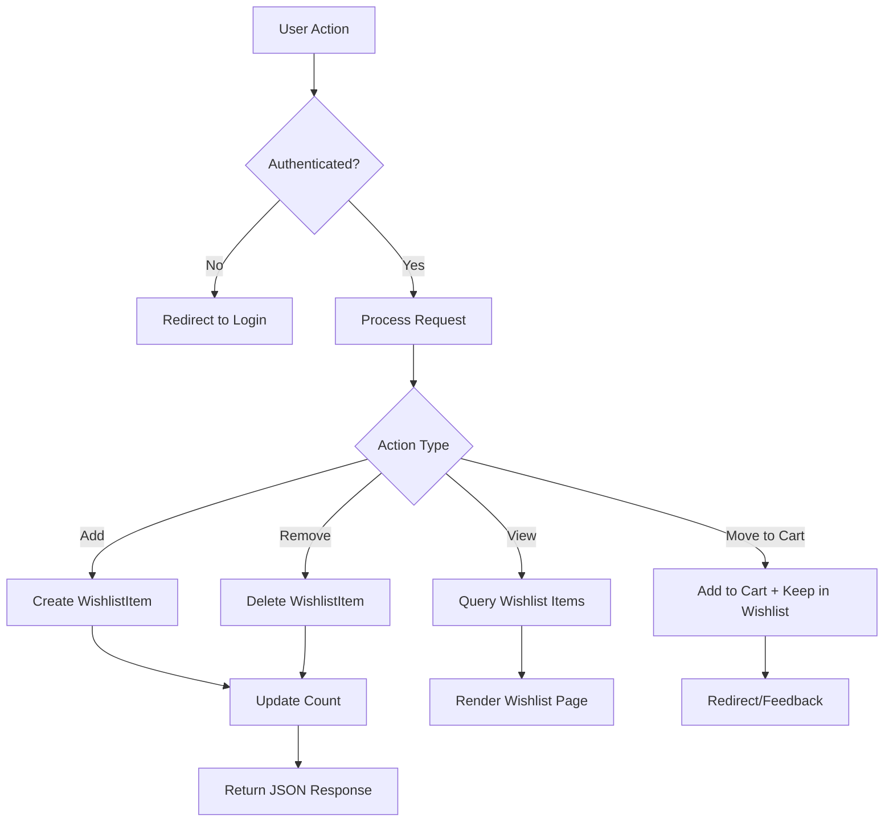
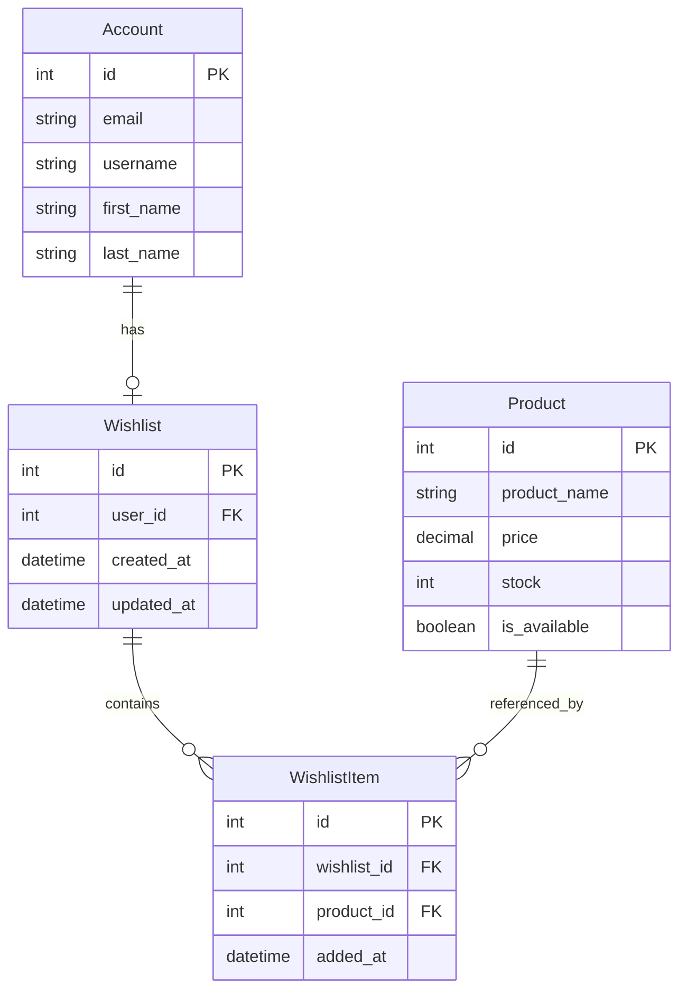

# Design Document: Wishlist/Favorites

## Overview

The Wishlist/Favorites feature enables authenticated users to save products for later consideration and easy access. This design integrates seamlessly with the existing GreatKart Django e-commerce application, following Django best practices and the existing application architecture.

The feature consists of:
- A new `wishlist` Django app with models, views, and templates
- Database model for storing user-product wishlist relationships
- RESTful views for adding/removing wishlist items
- Template integration with existing product pages and navigation
- AJAX-based interactions for smooth user experience

## Architecture

### Application Structure

The wishlist feature will be implemented as a new Django app called `wishlist` that integrates with existing apps:

```
wishlist/
├── __init__.py
├── admin.py          # Django admin configuration
├── apps.py           # App configuration
├── models.py         # Wishlist and WishlistItem models
├── views.py          # View functions for wishlist operations
├── urls.py           # URL routing
├── context_processors.py  # Wishlist count for templates
└── templates/
    └── wishlist/
        └── wishlist.html  # Wishlist page template
```

### Integration Points

1. **accounts app**: Uses the existing Account model for user authentication
2. **store app**: References the Product model for wishlist items
3. **templates**: Extends base templates and integrates with product listing/detail pages
4. **navigation**: Adds wishlist count to the global navigation context

### Data Flow



## Components and Interfaces

### Models

#### Wishlist Model

```python
class Wishlist(models.Model):
    """
    Represents a user's wishlist container.
    One-to-one relationship with User.
    """
    user = models.OneToOneField(Account, on_delete=models.CASCADE, related_name='wishlist')
    created_at = models.DateTimeField(auto_now_add=True)
    updated_at = models.DateTimeField(auto_now=True)
    
    def __str__(self):
        return f"Wishlist for {self.user.email}"
    
    def get_items_count(self):
        """Returns the number of items in the wishlist"""
        return self.items.count()
    
    def contains_product(self, product):
        """Check if a product is in the wishlist"""
        return self.items.filter(product=product).exists()
```

#### WishlistItem Model

```python
class WishlistItem(models.Model):
    """
    Represents a single product in a user's wishlist.
    Many-to-one relationship with Wishlist.
    """
    wishlist = models.ForeignKey(Wishlist, on_delete=models.CASCADE, related_name='items')
    product = models.ForeignKey(Product, on_delete=models.CASCADE)
    added_at = models.DateTimeField(auto_now_add=True)
    
    class Meta:
        unique_together = ('wishlist', 'product')
        ordering = ['-added_at']
    
    def __str__(self):
        return f"{self.product.product_name} in {self.wishlist.user.email}'s wishlist"
```

### Views

#### Wishlist Page View

```python
@login_required
def wishlist(request):
    """
    Display the user's wishlist page.
    Creates wishlist if it doesn't exist.
    """
    wishlist, created = Wishlist.objects.get_or_create(user=request.user)
    wishlist_items = wishlist.items.select_related('product').all()
    
    context = {
        'wishlist_items': wishlist_items,
        'wishlist_count': wishlist_items.count()
    }
    return render(request, 'wishlist/wishlist.html', context)
```

#### Add to Wishlist View

```python
@login_required
@require_POST
def add_to_wishlist(request, product_id):
    """
    Add a product to the user's wishlist.
    Returns JSON response for AJAX requests.
    """
    try:
        product = Product.objects.get(id=product_id)
        wishlist, created = Wishlist.objects.get_or_create(user=request.user)
        
        # Prevent duplicates
        wishlist_item, created = WishlistItem.objects.get_or_create(
            wishlist=wishlist,
            product=product
        )
        
        if created:
            message = f"{product.product_name} added to wishlist"
            status = 'added'
        else:
            message = f"{product.product_name} is already in your wishlist"
            status = 'exists'
        
        return JsonResponse({
            'success': True,
            'message': message,
            'status': status,
            'wishlist_count': wishlist.get_items_count()
        })
    
    except Product.DoesNotExist:
        return JsonResponse({
            'success': False,
            'message': 'Product not found'
        }, status=404)
```

#### Remove from Wishlist View

```python
@login_required
@require_POST
def remove_from_wishlist(request, product_id):
    """
    Remove a product from the user's wishlist.
    Returns JSON response for AJAX requests.
    """
    try:
        wishlist = Wishlist.objects.get(user=request.user)
        wishlist_item = WishlistItem.objects.get(
            wishlist=wishlist,
            product_id=product_id
        )
        product_name = wishlist_item.product.product_name
        wishlist_item.delete()
        
        return JsonResponse({
            'success': True,
            'message': f"{product_name} removed from wishlist",
            'wishlist_count': wishlist.get_items_count()
        })
    
    except (Wishlist.DoesNotExist, WishlistItem.DoesNotExist):
        return JsonResponse({
            'success': False,
            'message': 'Item not found in wishlist'
        }, status=404)
```

#### Check Wishlist Status View

```python
@login_required
def check_wishlist_status(request, product_id):
    """
    Check if a product is in the user's wishlist.
    Used for updating UI state.
    """
    try:
        wishlist = Wishlist.objects.get(user=request.user)
        in_wishlist = wishlist.contains_product(Product.objects.get(id=product_id))
        
        return JsonResponse({
            'in_wishlist': in_wishlist,
            'wishlist_count': wishlist.get_items_count()
        })
    except (Wishlist.DoesNotExist, Product.DoesNotExist):
        return JsonResponse({
            'in_wishlist': False,
            'wishlist_count': 0
        })
```

### Context Processor

```python
def wishlist_count(request):
    """
    Add wishlist count to all template contexts.
    """
    if request.user.is_authenticated:
        try:
            wishlist = Wishlist.objects.get(user=request.user)
            count = wishlist.get_items_count()
        except Wishlist.DoesNotExist:
            count = 0
    else:
        count = 0
    
    return {'wishlist_count': count}
```

### URL Configuration

```python
urlpatterns = [
    path('', views.wishlist, name='wishlist'),
    path('add/<int:product_id>/', views.add_to_wishlist, name='add_to_wishlist'),
    path('remove/<int:product_id>/', views.remove_from_wishlist, name='remove_from_wishlist'),
    path('check/<int:product_id>/', views.check_wishlist_status, name='check_wishlist_status'),
]
```

## Data Models

### Entity Relationship Diagram



### Database Constraints

1. **Unique Constraint**: (wishlist_id, product_id) - Prevents duplicate products in a wishlist
2. **Foreign Key Cascade**: When a User is deleted, their Wishlist and WishlistItems are deleted
3. **Foreign Key Cascade**: When a Product is deleted, all WishlistItems referencing it are deleted
4. **One-to-One**: Each User has exactly one Wishlist

## Correctness Properties

*A property is a characteristic or behavior that should hold true across all valid executions of a system—essentially, a formal statement about what the system should do. Properties serve as the bridge between human-readable specifications and machine-verifiable correctness guarantees.*


### Property 1: Wishlist Item Creation

*For any* authenticated user and any product, when the user adds the product to their wishlist, a WishlistItem should be created linking that user's wishlist to that product.

**Validates: Requirements 1.1**

### Property 2: Idempotent Add Operations

*For any* authenticated user and any product, adding the same product to the wishlist multiple times should result in exactly one WishlistItem, equivalent to adding it once.

**Validates: Requirements 1.2, 4.3**

### Property 3: Wishlist Count Accuracy

*For any* wishlist, the displayed count should always equal the number of WishlistItem records associated with that wishlist.

**Validates: Requirements 1.5, 2.2, 6.1**

### Property 4: Wishlist Item Deletion

*For any* wishlist item, when a user removes it from their wishlist, that WishlistItem record should no longer exist in the database.

**Validates: Requirements 2.1, 4.3**

### Property 5: Wishlist Page Completeness

*For any* user's wishlist, the wishlist page should display all products associated with that wishlist, including product name, price, and image.

**Validates: Requirements 3.1**

### Property 6: Product Availability Display

*For any* wishlist item, the rendered wishlist page should include the current availability status (is_available field) of that product.

**Validates: Requirements 3.3**

### Property 7: Remove Button Presence

*For any* wishlist with one or more items, the rendered wishlist page should contain a remove button for each item.

**Validates: Requirements 3.5**

### Property 8: Wishlist Icon State Reflects Membership

*For any* product and any authenticated user, the wishlist icon state (active/inactive) should match whether that product exists in the user's wishlist.

**Validates: Requirements 4.1, 4.2**

### Property 9: Toggle Add/Remove Behavior

*For any* product, clicking the wishlist icon when the product is not in the wishlist should add it, and clicking when it is in the wishlist should remove it.

**Validates: Requirements 4.3, 4.4**

### Property 10: Add to Cart from Wishlist

*For any* wishlist item without product variations, adding it to the cart should result in that product appearing in the user's cart with quantity 1.

**Validates: Requirements 5.1, 5.3**

### Property 11: Wishlist Persistence After Cart Addition

*For any* wishlist item, adding the product to the cart should not remove the item from the wishlist - the item should remain in both locations.

**Validates: Requirements 5.5**

### Property 12: Wishlist Persistence Across Sessions

*For any* user's wishlist state, logging out and logging back in should preserve all wishlist items - the wishlist after re-login should be identical to the wishlist before logout.

**Validates: Requirements 7.1, 7.2**

### Property 13: Product Deletion Cascade

*For any* product that exists in one or more wishlists, deleting that product should remove all WishlistItem records referencing it from all user wishlists.

**Validates: Requirements 7.3**

### Property 14: User Deletion Cascade

*For any* user with wishlist items, deleting that user's account should delete their Wishlist and all associated WishlistItem records.

**Validates: Requirements 7.4**

### Property 15: Wishlist Isolation

*For any* two different users, each user should only be able to access, view, and modify their own wishlist items, not the other user's wishlist items.

**Validates: Requirements 8.4**

## Error Handling

### Authentication Errors

1. **Unauthenticated Access**: When an unauthenticated user attempts to access wishlist functionality:
   - Wishlist page: Redirect to login page with `next` parameter
   - AJAX endpoints: Return 401 Unauthorized with JSON error message
   - After login: Redirect to originally requested page if `next` parameter exists

2. **Session Expiry**: When a user's session expires during wishlist operations:
   - Return 401 status code
   - Frontend should prompt re-authentication
   - Preserve intended action for post-login completion

### Product Errors

1. **Product Not Found**: When attempting to add/remove a non-existent product:
   - Return 404 Not Found with descriptive error message
   - Log the error for debugging
   - Display user-friendly error message in UI

2. **Product Deleted**: When viewing wishlist with deleted products:
   - Cascade deletion removes WishlistItem automatically (database constraint)
   - No orphaned wishlist items should exist
   - Wishlist page should only show existing products

### Database Errors

1. **Duplicate Prevention**: When attempting to create duplicate WishlistItem:
   - Use `get_or_create()` to handle gracefully
   - Return success with "already exists" message
   - Do not raise exception or show error to user

2. **Constraint Violations**: When database constraints are violated:
   - Catch IntegrityError exceptions
   - Log the error with full context
   - Return user-friendly error message
   - Rollback transaction

### Concurrent Access

1. **Race Conditions**: When multiple requests modify the same wishlist simultaneously:
   - Use database transactions for atomic operations
   - Rely on unique constraint to prevent duplicates
   - Last write wins for deletion operations

## Testing Strategy

### Dual Testing Approach

The wishlist feature will be validated using both unit tests and property-based tests:

- **Unit tests**: Verify specific examples, edge cases, and error conditions
- **Property tests**: Verify universal properties across all inputs using randomized data
- Both approaches are complementary and necessary for comprehensive coverage

### Property-Based Testing Configuration

- **Library**: Use `hypothesis` for Python/Django property-based testing
- **Iterations**: Minimum 100 iterations per property test
- **Tagging**: Each property test must include a comment referencing the design property
- **Tag format**: `# Feature: wishlist-favorites, Property {number}: {property_text}`

### Unit Testing Focus

Unit tests should focus on:
- Specific examples demonstrating correct behavior (e.g., adding a specific product)
- Edge cases (empty wishlist, out-of-stock products, products with variations)
- Error conditions (unauthenticated access, non-existent products)
- Integration points (wishlist-to-cart flow, cascade deletions)

Avoid writing too many unit tests for scenarios that property tests cover through randomization.

### Property Testing Focus

Property tests should focus on:
- Universal properties that hold for all inputs (idempotence, count accuracy, persistence)
- Comprehensive input coverage through randomization (random users, products, wishlist states)
- Invariants that must always hold (isolation, cascade behavior)

### Test Coverage Requirements

1. **Model Tests**:
   - Wishlist creation and retrieval
   - WishlistItem creation with unique constraint
   - Cascade deletion behavior
   - Helper methods (get_items_count, contains_product)

2. **View Tests**:
   - Authentication requirements for all views
   - Add/remove operations with valid and invalid data
   - JSON response format validation
   - Error handling for edge cases

3. **Integration Tests**:
   - Wishlist-to-cart flow
   - Context processor integration
   - Template rendering with wishlist data
   - AJAX interactions

4. **Property Tests** (one per correctness property):
   - Property 1: Wishlist Item Creation
   - Property 2: Idempotent Add Operations
   - Property 3: Wishlist Count Accuracy
   - Property 4: Wishlist Item Deletion
   - Property 5: Wishlist Page Completeness
   - Property 6: Product Availability Display
   - Property 7: Remove Button Presence
   - Property 8: Wishlist Icon State Reflects Membership
   - Property 9: Toggle Add/Remove Behavior
   - Property 10: Add to Cart from Wishlist
   - Property 11: Wishlist Persistence After Cart Addition
   - Property 12: Wishlist Persistence Across Sessions
   - Property 13: Product Deletion Cascade
   - Property 14: User Deletion Cascade
   - Property 15: Wishlist Isolation

### Test Data Generation

For property-based tests, use Hypothesis strategies to generate:
- Random users with valid email addresses and usernames
- Random products with varying availability, prices, and variation status
- Random wishlist states (empty, single item, multiple items)
- Random product-user combinations for testing isolation

### Frontend Testing

While property-based tests focus on backend logic, frontend behavior should be validated through:
- Manual testing of AJAX interactions
- Visual verification of icon states and count updates
- Cross-browser compatibility testing
- Accessibility testing for screen readers
